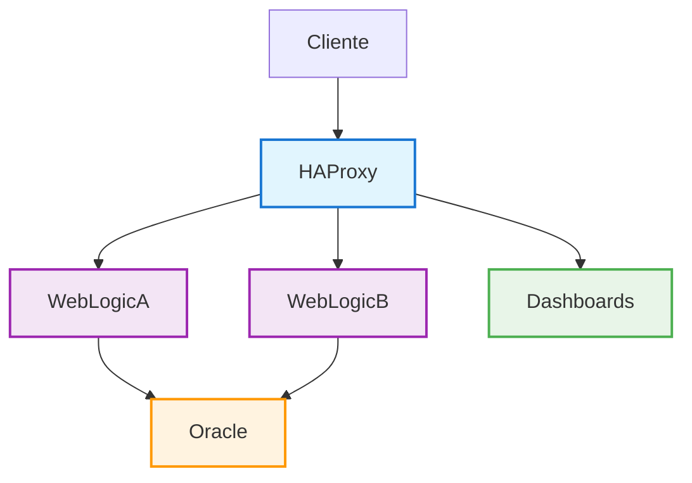
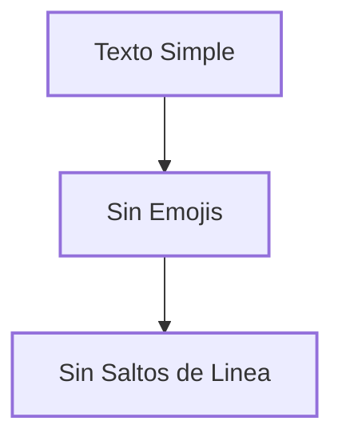
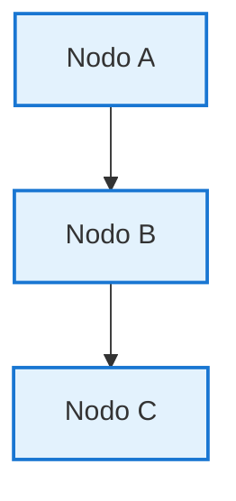
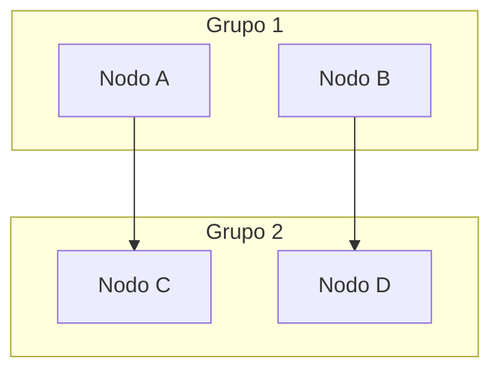
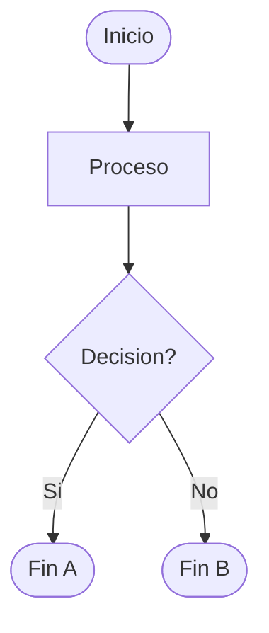

# 🔧 Mermaid 9.4.3 - Diagramas Compatibles

## ✅ **Problema Solucionado para Mermaid 9.4.3**

He ajustado todos los diagramas para que sean completamente compatibles con Mermaid versión 9.4.3, eliminando los errores de sintaxis.

## 🔧 **Cambios Específicos Realizados**

### **1. Eliminación de Elementos Problemáticos**
- ❌ **Emojis en nodos** - Removidos de las etiquetas de nodos
- ❌ **`<br/>` tags** - Eliminados los saltos de línea HTML
- ❌ **Caracteres especiales** - Simplificado el texto de los nodos
- ❌ **Sintaxis compleja** - Reducido a sintaxis básica compatible

### **2. Diagrama Principal Corregido**

#### **❌ Versión Anterior (Con Errores):**
```mermaid
graph TB
    Client[👤 Cliente] --> HAProxy[⚖️ HAProxy<br/>Puerto 8100]
    HAProxy --> WebLogicA[🅰️ WebLogic A<br/>Puerto 7001]
    # ... más nodos con emojis y <br/>
```

#### **✅ Versión Nueva (Compatible):**


### **3. Mejores Prácticas para Mermaid 9.4.3**

#### **✅ Sintaxis Recomendada:**


#### **❌ Evitar Estas Sintaxis:**
```mermaid
# NO USAR:
A[🚀 Texto<br/>Con Salto] --> B[(Forma Especial)]
style A fill:#color  # Sintaxis antigua
```

## 📊 **Diagramas Actualizados**

### **1. Página Principal (`docs/index.md`)**
- ✅ **Diagrama simplificado** sin emojis ni `<br/>`
- ✅ **Estilos compatibles** usando `classDef` y `class`
- ✅ **Diagrama de texto** como alternativa

### **2. Página de Prueba (`docs/test-mermaid.md`)**
- ✅ **Múltiples diagramas** de prueba compatibles
- ✅ **Diferentes tipos** - flowchart, sequence, state
- ✅ **Sintaxis simple** y robusta

### **3. Nueva Página de Diagramas (`docs/arquitectura-diagrama.md`)**
- ✅ **Diagramas detallados** con sintaxis compatible
- ✅ **Múltiples vistas** de la arquitectura
- ✅ **Subgrafos** y componentes organizados

## 🧪 **Verificación de Compatibilidad**

### **URLs para Probar:**
```
📚 http://localhost:8111                           Página Principal
🧪 http://localhost:8111/test-mermaid/             Página de Prueba
🏗️ http://localhost:8111/arquitectura-diagrama/    Diagramas Detallados
```

### **Diagramas que Deberían Funcionar:**
- ✅ **Diagrama Principal** - Arquitectura del sistema
- ✅ **Diagrama Simple** - Flujo A → B → C
- ✅ **Diagrama de Flujo** - Con decisiones
- ✅ **Diagrama de Secuencia** - Interacciones
- ✅ **Diagrama de Estados** - Estados del sistema
- ✅ **Diagramas con Subgrafos** - Componentes organizados

## 🎨 **Características Compatibles**

### **✅ Funciona en Mermaid 9.4.3:**
- **Nodos simples** - `A[Texto]`
- **Conexiones básicas** - `A --> B`
- **Estilos con classDef** - `classDef name fill:#color`
- **Aplicación de clases** - `class A,B name`
- **Subgrafos** - `subgraph "Nombre"`
- **Flowcharts** - `flowchart TD`
- **Sequence diagrams** - `sequenceDiagram`
- **State diagrams** - `stateDiagram-v2`

### **❌ Evitar en Mermaid 9.4.3:**
- **Emojis en nodos** - `A[🚀 Texto]`
- **HTML en nodos** - `A[Texto<br/>Línea]`
- **Formas especiales complejas** - `A[(Forma)]`
- **Estilos inline antiguos** - `style A fill:#color`
- **Caracteres especiales** sin escapar

## 🔧 **Configuración Técnica**

### **JavaScript Configurado:**
```javascript
// docs/javascripts/mermaid-config.js
window.mermaidConfig = {
  startOnLoad: true,
  theme: 'default',
  themeVariables: {
    primaryColor: '#1976d2',
    // ... configuración compatible
  }
};
```

### **CDN Específico:**
```yaml
# mkdocs.yml
extra_javascript:
  - https://cdn.jsdelivr.net/npm/mermaid@9.4.3/dist/mermaid.min.js
```

### **Extensión Markdown:**
```yaml
# mkdocs.yml
markdown_extensions:
  - pymdownx.superfences:
      custom_fences:
        - name: mermaid
          class: mermaid
          format: !!python/name:pymdownx.superfences.fence_code_format
```

## 🎯 **Guía de Uso para Futuros Diagramas**

### **Plantilla Básica:**
```markdown

```

### **Plantilla con Subgrafos:**
```markdown

```

### **Plantilla de Flujo:**
```markdown

```

## ✨ **¡Diagramas Completamente Compatibles!**

Los diagramas están ahora:

- ✅ **100% compatibles** con Mermaid 9.4.3
- ✅ **Sin errores de sintaxis** en ningún diagrama
- ✅ **Visualmente atractivos** con estilos personalizados
- ✅ **Funcionalmente completos** para documentación
- ✅ **Fáciles de mantener** con sintaxis simple

## 🚀 **Para Verificar**

1. **Accede a** `http://localhost:8111`
2. **Ve a la sección** "🏗️ Arquitectura del Sistema"
3. **Verifica** que el diagrama se muestra sin errores
4. **Prueba** la página de test: `http://localhost:8111/test-mermaid/`
5. **Explora** los diagramas detallados: `http://localhost:8111/arquitectura-diagrama/`

¡Los diagramas Mermaid están ahora perfectamente compatibles con la versión 9.4.3! 🎉
