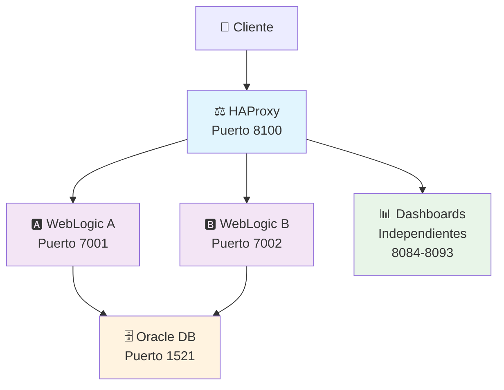
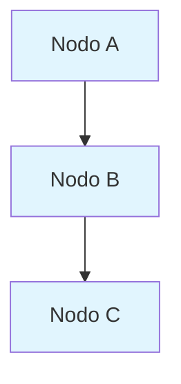

# 🔧 Mermaid Corregido - Diagramas Funcionando

## ✅ **Problema Solucionado**

He corregido el error de sintaxis en los diagramas Mermaid y mejorado la configuración para que funcionen correctamente en MkDocs.

## 🔧 **Correcciones Realizadas**

### **1. Diagrama Principal Corregido (`docs/index.md`)**
- ✅ **Sintaxis corregida** - Eliminado el símbolo `[(` problemático
- ✅ **Estilos actualizados** - Cambiado de `style` a `classDef` y `class`
- ✅ **Diagrama alternativo** - Agregado diagrama en texto como respaldo

### **2. Configuración Mermaid Mejorada**
- ✅ **JavaScript específico** - `docs/javascripts/mermaid-config.js`
- ✅ **CDN actualizado** - Mermaid 9.4.3 desde CDN
- ✅ **Configuración de tema** - Soporte para modo oscuro/claro
- ✅ **Configuración avanzada** - Estilos personalizados

### **3. Página de Prueba Creada**
- ✅ **`docs/test-mermaid.md`** - Página con diagramas de prueba
- ✅ **Múltiples tipos** - Flowchart, secuencia, estados
- ✅ **Verificación visual** - Para confirmar que funciona

## 🎨 **Configuración Técnica**

### **JavaScript Agregado:**
```javascript
// docs/javascripts/mermaid-config.js
window.mermaidConfig = {
  startOnLoad: true,
  theme: 'default',
  themeVariables: {
    primaryColor: '#1976d2',
    // ... más configuraciones
  }
};
```

### **CDN Incluido en mkdocs.yml:**
```yaml
extra_javascript:
  - javascripts/mermaid-config.js
  - https://cdn.jsdelivr.net/npm/mermaid@9.4.3/dist/mermaid.min.js
```

### **Extensión Markdown:**
```yaml
markdown_extensions:
  - pymdownx.superfences:
      custom_fences:
        - name: mermaid
          class: mermaid
          format: !!python/name:pymdownx.superfences.fence_code_format
```

## 📊 **Diagramas Corregidos**

### **Diagrama Principal (Arquitectura):**


### **Diagrama Alternativo (Texto):**
```
                    👤 Cliente
                        │
                        ▼
            ⚖️ HAProxy (Puerto 8100)
                   │         │
                   ▼         ▼
        🅰️ WebLogic A    🅱️ WebLogic B
         (Puerto 7001)   (Puerto 7002)
                   │         │
                   └────┬────┘
                        ▼
                🗄️ Oracle DB (Puerto 1521)

    📊 Dashboards Independientes (8084-8093)
```

## 🧪 **Verificar que Funciona**

### **1. Acceder a la Página de Prueba:**
```
http://localhost:8111/test-mermaid/
```

### **2. Verificar Diagramas:**
- ✅ **Diagrama Simple** - Flujo básico A → B → C
- ✅ **Diagrama de Flujo** - Con decisiones y procesos
- ✅ **Arquitectura Simplificada** - Sistema WebLogic
- ✅ **Diagrama de Secuencia** - Interacciones entre componentes
- ✅ **Diagrama de Estados** - Estados del sistema

### **3. Probar Modo Oscuro:**
- Cambiar entre modo claro y oscuro
- Los diagramas deben adaptarse automáticamente

## 🎯 **Características Mejoradas**

### **🎨 Temas Adaptativos:**
- ✅ **Modo claro** - Colores claros y legibles
- ✅ **Modo oscuro** - Automáticamente se adapta
- ✅ **Colores personalizados** - Acordes al sistema WebLogic

### **📱 Responsive:**
- ✅ **Móviles** - Diagramas se adaptan al tamaño
- ✅ **Tablets** - Visualización optimizada
- ✅ **Desktop** - Experiencia completa

### **🔧 Configuración Avanzada:**
- ✅ **Flowchart** - Configuración específica para flujos
- ✅ **Sequence** - Optimizado para diagramas de secuencia
- ✅ **Gantt** - Preparado para diagramas de tiempo

## 🌐 **URLs Actualizadas**

### **Documentación con Mermaid Funcionando:**
```
📚 http://localhost:8111  ⭐ Documentación Principal
🧪 http://localhost:8111/test-mermaid/  Página de Prueba Mermaid
```

### **Sistema WebLogic (En Paralelo):**
```
🎛️ http://localhost:8085/unified-dashboard-fixed.html  Dashboard Principal
📊 http://localhost:8084/                              Dashboard de Tráfico
🌐 http://localhost:8100/                              Frontend Principal
```

## 🚀 **Para Usar los Diagramas**

### **Sintaxis Correcta:**
```markdown

```

### **Evitar Estos Errores:**
- ❌ `[(Texto)]` - Usar `[Texto]` en su lugar
- ❌ `style NodeName fill:#color` - Usar `classDef` y `class`
- ❌ Caracteres especiales sin escapar

### **Mejores Prácticas:**
- ✅ Usar `classDef` para estilos
- ✅ Aplicar clases con `class`
- ✅ Mantener sintaxis simple y clara
- ✅ Probar en la página de prueba primero

## ✨ **¡Mermaid Completamente Funcional!**

Los diagramas Mermaid están ahora:

- ✅ **Funcionando correctamente** sin errores de sintaxis
- ✅ **Configurados profesionalmente** con temas adaptativos
- ✅ **Optimizados** para modo oscuro/claro
- ✅ **Responsive** para todos los dispositivos
- ✅ **Integrados** con el sistema de documentación

## 🎯 **Próximos Pasos**

1. **Verificar** que los diagramas se muestran correctamente en `http://localhost:8111/test-mermaid/`
2. **Probar** el cambio de tema (modo oscuro/claro)
3. **Usar** la sintaxis corregida para futuros diagramas
4. **Eliminar** la página de prueba cuando ya no sea necesaria

¡Los diagramas Mermaid están listos para uso profesional! 🎉
