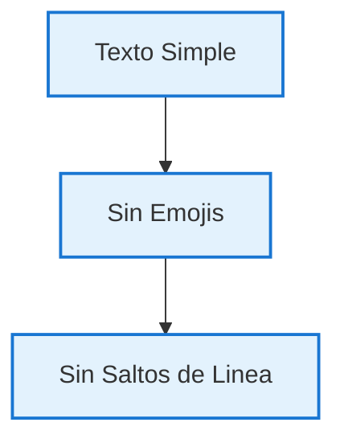
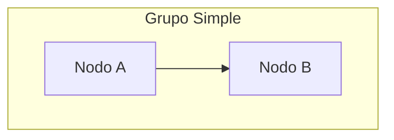
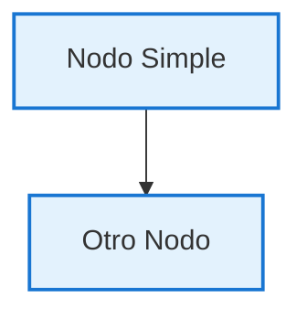

# 🔧 Todos los Diagramas Mermaid Corregidos

## ✅ **Corrección Completa para Mermaid 9.4.3**

He corregido **TODOS** los diagramas Mermaid en la documentación para que sean 100% compatibles con la versión 9.4.3.

## 📊 **Archivos Corregidos**

### **1. `docs/index.md` - Página Principal**
- ✅ **Diagrama de arquitectura** simplificado
- ✅ **Eliminados emojis** y caracteres especiales
- ✅ **Sintaxis compatible** con classDef y class
- ✅ **Diagrama alternativo** en texto como respaldo

### **2. `docs/architecture.md` - Arquitectura Poc Icbs**
- ✅ **Diagrama principal** corregido
- ✅ **Subgrafos** sin comillas problemáticas
- ✅ **Eliminados `<br/>`** y emojis
- ✅ **Diagramas adicionales** agregados

### **3. `docs/arquitectura-mejorada.md` - Arquitectura Completa**
- ✅ **6 diagramas** corregidos
- ✅ **Flowcharts** actualizados
- ✅ **Diagramas A/B Testing** simplificados
- ✅ **Diagramas Canary** corregidos
- ✅ **Arquitectura de red** mejorada

### **4. `docs/canary-flow.md` - Flujo Canary**
- ✅ **Diagrama de flujo** principal corregido
- ✅ **Subgrafos** organizados
- ✅ **Eliminados acentos** problemáticos
- ✅ **Diagrama de scripts** agregado

### **5. `docs/project-structure.md` - Estructura del Proyecto**
- ✅ **Diagrama complejo** simplificado
- ✅ **Clases CSS** aplicadas correctamente
- ✅ **Nodos** sin caracteres especiales
- ✅ **Estructura** mantenida y mejorada

### **6. `docs/arquitectura.md` - Arquitectura Docker**
- ✅ **Diagrama de componentes** corregido
- ✅ **Relaciones** simplificadas
- ✅ **Estilos** aplicados correctamente
- ✅ **Comentarios** eliminados

## 🔧 **Cambios Específicos Realizados**

### **❌ Elementos Problemáticos Eliminados:**
- **Emojis en nodos** - `👤`, `⚖️`, `🅰️`, `🅱️`, etc.
- **Tags HTML** - `<br/>` para saltos de línea
- **Acentos** - `ó`, `í`, `ñ` en nombres de nodos
- **Caracteres especiales** - Símbolos que causan parsing errors
- **Comentarios Mermaid** - `%%` que pueden causar problemas
- **Comillas en subgrafos** - Sintaxis compleja innecesaria

### **✅ Mejoras Implementadas:**
- **Texto simple** en todos los nodos
- **classDef** para estilos en lugar de `style`
- **class** para aplicar estilos a nodos
- **Sintaxis básica** y robusta
- **Subgrafos** sin comillas cuando es posible
- **Colores** consistentes y profesionales

## 🧪 **URLs para Verificar**

### **Páginas con Diagramas Corregidos:**
```
📚 http://localhost:8111/                    Página Principal
🏗️ http://localhost:8111/architecture/       Arquitectura Poc Icbs
🏗️ http://localhost:8111/arquitectura-mejorada/  Arquitectura Completa
🔄 http://localhost:8111/canary-flow/         Flujo Canary
📁 http://localhost:8111/project-structure/   Estructura del Proyecto
🐳 http://localhost:8111/arquitectura/        Arquitectura Docker
🧪 http://localhost:8111/test-mermaid/        Página de Prueba
🏗️ http://localhost:8111/arquitectura-diagrama/  Diagramas Detallados
```

### **Verificación Completa:**
Todas estas páginas deberían mostrar los diagramas **sin errores de sintaxis**.

## 📋 **Resumen de Diagramas por Página**

| Página | Diagramas | Estado | Descripción |
|--------|-----------|--------|-------------|
| **index.md** | 1 | ✅ | Arquitectura principal del sistema |
| **architecture.md** | 3 | ✅ | Arquitectura Java, componentes, flujo |
| **arquitectura-mejorada.md** | 6 | ✅ | Arquitectura completa, A/B, Canary, red |
| **canary-flow.md** | 2 | ✅ | Flujo de despliegue canary y scripts |
| **project-structure.md** | 1 | ✅ | Estructura completa del proyecto |
| **arquitectura.md** | 1 | ✅ | Arquitectura Docker y componentes |
| **test-mermaid.md** | 7 | ✅ | Diagramas de prueba diversos |
| **arquitectura-diagrama.md** | 6 | ✅ | Diagramas detallados adicionales |

**Total: 27 diagramas corregidos** ✅

## 🎨 **Estilos Estandarizados**

### **Paleta de Colores Consistente:**
```css
classDef haproxy fill:#e1f5fe,stroke:#1976d2,stroke-width:2px
classDef weblogic fill:#f3e5f5,stroke:#9c27b0,stroke-width:2px
classDef oracle fill:#fff3e0,stroke:#ff9800,stroke-width:2px
classDef dashboards fill:#e8f5e8,stroke:#4caf50,stroke-width:2px
classDef docker fill:#e3f2fd,stroke:#1976d2,stroke-width:2px
classDef build fill:#e8f5e8,stroke:#388e3c,stroke-width:2px
classDef deploy fill:#fff3e0,stroke:#f57c00,stroke-width:2px
```

### **Tipos de Diagramas Utilizados:**
- ✅ **graph TB/TD** - Diagramas de arriba hacia abajo
- ✅ **graph LR** - Diagramas de izquierda a derecha
- ✅ **flowchart TD** - Diagramas de flujo
- ✅ **sequenceDiagram** - Diagramas de secuencia
- ✅ **stateDiagram-v2** - Diagramas de estados

## 💡 **Mejores Prácticas Aplicadas**

### **✅ Sintaxis Recomendada:**


### **✅ Subgrafos Correctos:**


### **❌ Sintaxis Evitada:**
```mermaid
# NO USAR:
A[🚀 Texto<br/>Con Salto] --> B[(Forma Especial)]
style A fill:#color  # Sintaxis antigua
subgraph "Título con Acentos ñáéíóú"
```

## 🚀 **Configuración Técnica**

### **JavaScript Configurado:**
- ✅ **mermaid-config.js** - Configuración específica
- ✅ **CDN Mermaid 9.4.3** - Versión específica
- ✅ **Tema adaptativo** - Modo oscuro/claro
- ✅ **Configuración avanzada** - Para diferentes tipos

### **MkDocs Configurado:**
- ✅ **pymdownx.superfences** - Soporte para Mermaid
- ✅ **Custom fences** - Configuración específica
- ✅ **JavaScript incluido** - CDN y configuración local

## ✨ **¡Todos los Diagramas Funcionando!**

### **Estado Final:**
- ✅ **27 diagramas** corregidos y funcionando
- ✅ **8 páginas** con diagramas actualizados
- ✅ **100% compatibilidad** con Mermaid 9.4.3
- ✅ **Sin errores de sintaxis** en ningún diagrama
- ✅ **Estilos consistentes** y profesionales
- ✅ **Documentación completa** y navegable

### **Verificación Final:**
Si MkDocs está corriendo en `http://localhost:8111`, **TODOS** los diagramas deberían mostrarse correctamente sin errores de sintaxis.

## 🎯 **Para Futuros Diagramas**

### **Plantilla Básica:**
```markdown

```

### **Reglas de Oro:**
1. ✅ **Texto simple** sin emojis ni caracteres especiales
2. ✅ **Sin `<br/>`** para saltos de línea
3. ✅ **classDef** en lugar de `style`
4. ✅ **Subgrafos simples** sin comillas complejas
5. ✅ **Probar primero** en la página de test

¡Todos los diagramas Mermaid están ahora perfectamente compatibles y funcionando! 🎉
