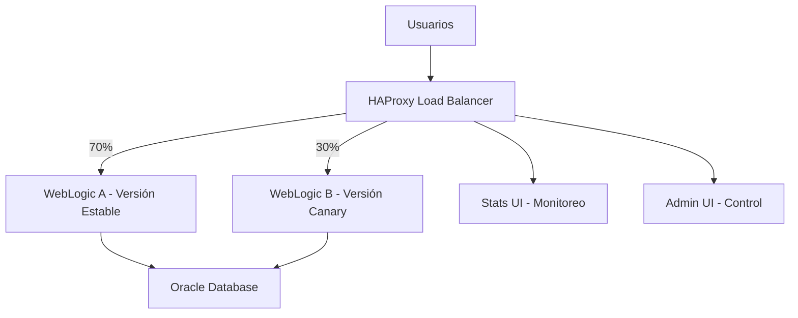

# 🎯 Guía Completa de Despliegues Canary

## Introducción

Los despliegues canary permiten lanzar nuevas versiones de aplicaciones de manera gradual y controlada, minimizando el riesgo y permitiendo rollbacks rápidos en caso de problemas.

## Conceptos Fundamentales

### ¿Qué es un Despliegue Canary?

Un despliegue canary es una técnica donde:
- Se despliega una nueva versión a un subconjunto pequeño de usuarios
- Se monitorea el comportamiento y métricas
- Se incrementa gradualmente el tráfico si todo va bien
- Se puede hacer rollback inmediato si hay problemas

### Arquitectura Canary en Nuestro Sistema



## Configuración Inicial

### 1. Verificar Estado del Sistema

```bash
# Verificar que ambos WebLogic estén funcionando
./scripts/validation/check-urls.sh

# Verificar estado en HAProxy Stats
curl -u admin:admin123 "http://localhost:8404/stats;csv" | grep weblogic
```

### 2. Configurar Canary por Primera Vez

```bash
# Ejecutar configuración inicial
./scripts/canary/setup-canary.sh

# Verificar configuración
curl -u admin:admin123 http://localhost:8404/stats
```

## Gestión de Tráfico

### Comandos Básicos de Control

#### Distribución de Tráfico
```bash
# Distribución 50/50 (testing inicial)
./scripts/canary/manage-traffic.sh --weblogic-a 50 --weblogic-b 50

# Distribución 90/10 (canary conservador)
./scripts/canary/manage-traffic.sh --weblogic-a 90 --weblogic-b 10

# Distribución 70/30 (canary moderado)
./scripts/canary/manage-traffic.sh --weblogic-a 70 --weblogic-b 30

# Todo el tráfico a A (rollback completo)
./scripts/canary/manage-traffic.sh --weblogic-a 100 --weblogic-b 0

# Todo el tráfico a B (promoción completa)
./scripts/canary/manage-traffic.sh --weblogic-a 0 --weblogic-b 100
```

#### Verificar Distribución Actual
```bash
# Ver pesos actuales
curl -u admin:admin123 "http://localhost:8404/stats;csv" | \
  grep -E "(weblogic-a|weblogic-b)" | \
  cut -d',' -f1,2,19

# Formato legible
./scripts/canary/canary-control.sh status
```

### Control Avanzado

#### Script de Control Interactivo
```bash
# Ejecutar controlador interactivo
./scripts/canary/canary-control.sh

# Opciones disponibles:
# 1. Ver estado actual
# 2. Cambiar distribución
# 3. Rollback completo
# 4. Promoción completa
# 5. Simular tráfico
# 6. Ver métricas
```

## Proceso de Despliegue Canary

### Fase 1: Preparación

#### 1.1 Backup de Configuración Actual
```bash
# Crear backup de la configuración actual
DATE=$(date +%Y%m%d-%H%M%S)
tar -czf canary-backup-$DATE.tar.gz \
  weblogic/ haproxy/config/ .env

# Backup de aplicaciones actuales
docker exec weblogic-a tar -czf /tmp/apps-backup-$DATE.tar.gz \
  /u01/oracle/user_projects/domains/base_domain/autodeploy/
docker cp weblogic-a:/tmp/apps-backup-$DATE.tar.gz ./
```

#### 1.2 Verificar Estado Inicial
```bash
# Verificar que el sistema esté estable
./scripts/validation/validate-complete-system.sh

# Verificar métricas baseline
curl -u admin:admin123 "http://localhost:8404/stats;csv" > baseline-metrics.csv
```

### Fase 2: Despliegue de Versión Canary

#### 2.1 Desplegar Nueva Versión en WebLogic B
```bash
# Detener WebLogic B temporalmente
./scripts/core/docker-compose-wrapper.sh stop weblogic-b

# Copiar nueva aplicación
cp new-version.war weblogic/deployments/

# Iniciar WebLogic B con nueva versión
./scripts/core/docker-compose-wrapper.sh start weblogic-b

# Verificar que inicie correctamente
docker logs weblogic-b --tail 20
```

#### 2.2 Verificar Nueva Versión
```bash
# Test directo a WebLogic B
curl -I http://localhost:7002/your-app

# Verificar logs de aplicación
docker exec weblogic-b tail -f /u01/oracle/user_projects/domains/base_domain/servers/AdminServer/logs/AdminServer.log
```

### Fase 3: Inicio del Canary

#### 3.1 Configurar Tráfico Inicial (5%)
```bash
# Empezar con muy poco tráfico
./scripts/canary/manage-traffic.sh --weblogic-a 95 --weblogic-b 5

# Verificar configuración
curl -u admin:admin123 http://localhost:8404/stats
```

#### 3.2 Monitoreo Inicial
```bash
# Simular tráfico para testing
./scripts/canary/simulate-traffic.sh &
TRAFFIC_PID=$!

# Monitorear por 10 minutos
for i in {1..10}; do
  echo "=== Minuto $i ==="
  curl -u admin:admin123 "http://localhost:8404/stats;csv" | \
    grep -E "(weblogic-a|weblogic-b)" | \
    cut -d',' -f1,2,8,9,10
  sleep 60
done

# Detener tráfico de prueba
kill $TRAFFIC_PID
```

### Fase 4: Incremento Gradual

#### 4.1 Incrementar a 10%
```bash
# Si las métricas son buenas, incrementar
./scripts/canary/manage-traffic.sh --weblogic-a 90 --weblogic-b 10

# Monitorear por 15 minutos
./scripts/monitoring/start-url-monitoring.sh
```

#### 4.2 Incrementar a 25%
```bash
# Continuar incrementando gradualmente
./scripts/canary/manage-traffic.sh --weblogic-a 75 --weblogic-b 25

# Verificar métricas clave
echo "=== Métricas de Error ==="
curl -u admin:admin123 "http://localhost:8404/stats;csv" | \
  grep -E "(weblogic-a|weblogic-b)" | \
  cut -d',' -f1,2,14,15
```

#### 4.3 Incrementar a 50%
```bash
# Si todo va bien, balancear 50/50
./scripts/canary/manage-traffic.sh --weblogic-a 50 --weblogic-b 50

# Monitoreo intensivo
./scripts/testing/test-performance.sh
```

### Fase 5: Promoción o Rollback

#### 5.1 Promoción Completa (Si todo va bien)
```bash
# Mover todo el tráfico a la nueva versión
./scripts/canary/manage-traffic.sh --weblogic-a 0 --weblogic-b 100

# Monitorear por 30 minutos
./scripts/monitoring/start-url-monitoring.sh

# Si es estable, actualizar WebLogic A con la nueva versión
./scripts/core/docker-compose-wrapper.sh stop weblogic-a
cp new-version.war weblogic/deployments/
./scripts/core/docker-compose-wrapper.sh start weblogic-a

# Restaurar balanceo normal
./scripts/canary/manage-traffic.sh --weblogic-a 50 --weblogic-b 50
```

#### 5.2 Rollback (Si hay problemas)
```bash
# Rollback inmediato - todo el tráfico a versión estable
./scripts/canary/manage-traffic.sh --weblogic-a 100 --weblogic-b 0

# Verificar que el sistema esté estable
./scripts/validation/check-urls.sh

# Restaurar versión anterior en WebLogic B
./scripts/core/docker-compose-wrapper.sh stop weblogic-b
# Restaurar aplicación anterior
./scripts/core/docker-compose-wrapper.sh start weblogic-b

# Restaurar balanceo normal
./scripts/canary/manage-traffic.sh --weblogic-a 50 --weblogic-b 50
```

## Monitoreo y Métricas

### Métricas Clave a Monitorear

#### 1. Tasa de Error
```bash
# Verificar errores por servidor
curl -u admin:admin123 "http://localhost:8404/stats;csv" | \
  awk -F',' '$1 ~ /weblogic/ {print $1 ": Errors=" $14 " Total=" $8 " Rate=" ($14/$8)*100 "%"}'
```

#### 2. Tiempo de Respuesta
```bash
# Verificar tiempos de respuesta
curl -u admin:admin123 "http://localhost:8404/stats;csv" | \
  awk -F',' '$1 ~ /weblogic/ {print $1 ": AvgTime=" $40 "ms"}'
```

#### 3. Throughput
```bash
# Verificar requests por segundo
curl -u admin:admin123 "http://localhost:8404/stats;csv" | \
  awk -F',' '$1 ~ /weblogic/ {print $1 ": ReqRate=" $47 "/s"}'
```

### Scripts de Monitoreo Automático

#### Monitoreo Continuo
```bash
# Script de monitoreo cada 30 segundos
cat > monitor-canary.sh << 'EOF'
#!/bin/bash
while true; do
  echo "=== $(date) ==="
  curl -s -u admin:admin123 "http://localhost:8404/stats;csv" | \
    awk -F',' '$1 ~ /weblogic/ {
      printf "%s: Weight=%s Requests=%s Errors=%s ErrorRate=%.2f%%\n", 
      $1, $19, $8, $14, ($14/$8)*100
    }'
  echo ""
  sleep 30
done
EOF

chmod +x monitor-canary.sh
./monitor-canary.sh
```

#### Alertas Automáticas
```bash
# Script de alertas por email/slack
cat > canary-alerts.sh << 'EOF'
#!/bin/bash
ERROR_THRESHOLD=5  # 5% error rate
RESPONSE_THRESHOLD=1000  # 1000ms response time

# Verificar métricas
STATS=$(curl -s -u admin:admin123 "http://localhost:8404/stats;csv")

# Verificar WebLogic B (canary)
B_ERRORS=$(echo "$STATS" | awk -F',' '$1=="weblogic-b" {print ($14/$8)*100}')
B_RESPONSE=$(echo "$STATS" | awk -F',' '$1=="weblogic-b" {print $40}')

if (( $(echo "$B_ERRORS > $ERROR_THRESHOLD" | bc -l) )); then
  echo "ALERT: Canary error rate too high: $B_ERRORS%"
  # Enviar alerta
  # ./scripts/canary/manage-traffic.sh --weblogic-a 100 --weblogic-b 0
fi

if (( $(echo "$B_RESPONSE > $RESPONSE_THRESHOLD" | bc -l) )); then
  echo "ALERT: Canary response time too high: ${B_RESPONSE}ms"
  # Enviar alerta
fi
EOF

chmod +x canary-alerts.sh

# Ejecutar cada 5 minutos
# */5 * * * * /path/to/canary-alerts.sh
```

## Estrategias Avanzadas

### 1. Canary por Características de Usuario

#### Configuración por Headers
```bash
# Editar haproxy.cfg para routing por headers
# Ejemplo: usuarios beta reciben versión canary
acl is_beta_user hdr(X-User-Type) -i beta
use_backend weblogic_canary if is_beta_user
```

#### Configuración por IP
```bash
# Canary para IPs específicas (empleados internos)
acl internal_ips src 192.168.1.0/24
use_backend weblogic_canary if internal_ips
```

### 2. Canary por Funcionalidad

#### Feature Flags Integration
```bash
# Desplegar con feature flags deshabilitados
# Habilitar gradualmente features específicas
curl -X POST http://localhost:8083/feature-flags/api/toggle \
  -d '{"feature": "new-checkout", "enabled": true, "percentage": 10}'
```

### 3. Canary Automático

#### Script de Canary Automático
```bash
cat > auto-canary.sh << 'EOF'
#!/bin/bash
set -e

STAGES=(5 10 25 50 100)
WAIT_TIME=300  # 5 minutos entre stages

echo "Iniciando despliegue canary automático..."

for stage in "${STAGES[@]}"; do
  echo "=== Configurando tráfico: $stage% canary ==="
  
  # Configurar tráfico
  ./scripts/canary/manage-traffic.sh --weblogic-a $((100-stage)) --weblogic-b $stage
  
  # Esperar y monitorear
  echo "Esperando $WAIT_TIME segundos..."
  sleep $WAIT_TIME
  
  # Verificar métricas
  ERROR_RATE=$(curl -s -u admin:admin123 "http://localhost:8404/stats;csv" | \
    awk -F',' '$1=="weblogic-b" {print ($14/$8)*100}')
  
  if (( $(echo "$ERROR_RATE > 5" | bc -l) )); then
    echo "ERROR: Tasa de error muy alta ($ERROR_RATE%), ejecutando rollback"
    ./scripts/canary/manage-traffic.sh --weblogic-a 100 --weblogic-b 0
    exit 1
  fi
  
  echo "Stage $stage% completado exitosamente"
done

echo "Despliegue canary completado exitosamente!"
EOF

chmod +x auto-canary.sh
```

## Mejores Prácticas

### 1. Preparación
- Siempre crear backups antes del despliegue
- Verificar que el sistema esté estable
- Definir métricas de éxito/fallo claramente
- Preparar plan de rollback

### 2. Durante el Despliegue
- Incrementar tráfico gradualmente
- Monitorear métricas continuamente
- Mantener logs detallados
- Estar preparado para rollback inmediato

### 3. Monitoreo
- Definir umbrales de alerta claros
- Monitorear múltiples métricas (errores, latencia, throughput)
- Usar alertas automáticas
- Mantener comunicación con stakeholders

### 4. Rollback
- Tener procedimiento de rollback bien definido
- Practicar rollbacks en entorno de testing
- Documentar razones de rollback
- Analizar post-mortem

## Troubleshooting Canary

### Problemas Comunes

#### 1. Distribución de Tráfico No Funciona
```bash
# Verificar configuración HAProxy
docker exec haproxy cat /usr/local/etc/haproxy/haproxy.cfg | grep -A 5 -B 5 weight

# Verificar que ambos backends estén UP
curl -u admin:admin123 http://localhost:8404/stats

# Recargar configuración
./scripts/auto-update-haproxy.sh
```

#### 2. Métricas Inconsistentes
```bash
# Limpiar estadísticas de HAProxy
curl -X POST -u admin:admin123 "http://localhost:8404/stats" \
  -d "action=clear&table=*"

# Reiniciar monitoreo
./scripts/monitoring/start-url-monitoring.sh
```

#### 3. Rollback No Funciona
```bash
# Forzar rollback manual
./scripts/core/docker-compose-wrapper.sh stop weblogic-b
./scripts/canary/manage-traffic.sh --weblogic-a 100 --weblogic-b 0
./scripts/core/docker-compose-wrapper.sh start weblogic-b
```

## Casos de Uso Avanzados

### 1. Canary para Microservicios
- Configurar canary por servicio específico
- Usar service mesh para control granular
- Implementar circuit breakers

### 2. Canary con A/B Testing
- Combinar canary con experimentos A/B
- Usar analytics para medir impacto en negocio
- Implementar statistical significance testing

### 3. Canary Multi-Región
- Desplegar canary en una región primero
- Usar DNS para routing geográfico
- Implementar failover cross-region

---

## Enlaces Relacionados

- [Arquitectura del Sistema](arquitectura.md)
- [Configuración HAProxy](haproxy.md)
- [Guía de Despliegue](deployment.md)
- [Scripts de Automatización](scripts/index.md)
- [Troubleshooting](TROUBLESHOOTING.md)
