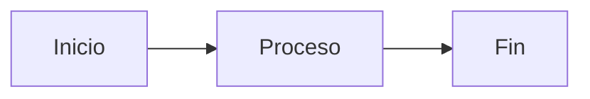

# Documentación del Proyecto

Esta carpeta contiene toda la documentación del proyecto Docker Oracle WebLogic, organizada y servida usando MkDocs.

## 📁 Estructura de la Documentación

```
docs/
├── index.md                           # Página principal
├── installation.md                    # Guía de instalación
├── arquitectura.md                    # Arquitectura del sistema
├── project-structure.md               # Estructura del proyecto
├── deployment-guide.md                # Guía de despliegue
├── build-scripts.md                   # Scripts de construcción
├── redeployment-guide.md              # Guía de redespliegue
├── canary-flow.md                     # Flujo de canary deployment
├── feature-flags-deployment.md        # Despliegue con feature flags
├── haproxy-guide.md                   # Configuración de HAProxy
├── haproxy-dashboard-and-ab-testing.md # Dashboard y A/B testing
├── troubleshooting.md                 # Solución de problemas
├── faq.md                             # Preguntas frecuentes
├── assets/
│   └── images/                        # Imágenes y recursos
└── references/                        # Documentación de referencia
    ├── weblogic-commands.md
    ├── ff4j-integration.md
    └── canary-deployment.md
```

## 🚀 Cómo Usar la Documentación

### Servir Localmente

Para ver la documentación en tu navegador:

```bash
# Desde la raíz del proyecto
./build-docs.sh serve
```

La documentación estará disponible en: http://localhost:8000

### Construir Sitio Estático

Para generar el sitio estático:

```bash
./build-docs.sh build
```

El sitio se generará en la carpeta `site/`.

### Comandos Disponibles

```bash
./build-docs.sh serve    # Servidor de desarrollo
./build-docs.sh build    # Construir sitio estático
./build-docs.sh deploy   # Desplegar a GitHub Pages
./build-docs.sh clean    # Limpiar archivos generados
./build-docs.sh help     # Mostrar ayuda
```

## 📝 Contribuir a la Documentación

### Agregar Nueva Página

1. Crea un nuevo archivo `.md` en la carpeta `docs/`
2. Agrega la página al archivo `mkdocs.yml` en la sección `nav:`
3. Usa el formato Markdown estándar

### Formato y Estilo

La documentación usa Material for MkDocs con las siguientes extensiones:

- **Mermaid**: Para diagramas
- **Admonitions**: Para notas y advertencias
- **Code highlighting**: Para código
- **Tabs**: Para contenido con pestañas

#### Ejemplos de Formato

**Nota informativa:**
```markdown
!!! info "Información"
    Este es un bloque de información importante.
```

**Advertencia:**
```markdown
!!! warning "Advertencia"
    Ten cuidado con esta configuración.
```

**Código con pestañas:**
```markdown
=== "Bash"
    ```bash
    ./script.sh
    ```

=== "PowerShell"
    ```powershell
    .\script.ps1
    ```
```

**Diagrama Mermaid:**
```markdown

```

### Imágenes y Assets

- Coloca imágenes en `docs/assets/images/`
- Usa rutas relativas: ``
- Optimiza imágenes para web (PNG, JPG, SVG)

### Enlaces

- Enlaces internos: `[Texto](page.md)`
- Enlaces externos: `[Texto](https://example.com)`
- Enlaces a secciones: `[Texto](page.md#section)`

## 🎨 Personalización

### Tema

El tema se configura en `mkdocs.yml`:

```yaml
theme:
  name: material
  palette:
    - scheme: default
      primary: blue
      accent: blue
```

### Plugins

Plugins habilitados:

- `search`: Búsqueda en el sitio
- `awesome-pages`: Navegación automática
- `mermaid2`: Diagramas Mermaid

### Extensiones Markdown

- `admonition`: Bloques de nota
- `pymdownx.superfences`: Código avanzado
- `pymdownx.tabbed`: Pestañas
- `toc`: Tabla de contenidos

## 📋 Checklist para Nuevas Páginas

- [ ] Título claro y descriptivo
- [ ] Introducción que explique el propósito
- [ ] Secciones bien organizadas
- [ ] Ejemplos de código cuando sea relevante
- [ ] Enlaces a páginas relacionadas
- [ ] Imágenes optimizadas si es necesario
- [ ] Revisión de ortografía y gramática
- [ ] Prueba en servidor local

## 🔧 Configuración Técnica

### Requisitos

- Python 3.8+
- MkDocs 1.6+
- Material for MkDocs 9.6+

### Instalación de Dependencias

```bash
# Crear entorno virtual
python3 -m venv mkdocs-env
source mkdocs-env/bin/activate

# Instalar dependencias
pip install mkdocs mkdocs-material mkdocs-mermaid2-plugin mkdocs-awesome-pages-plugin
```

### Configuración de Desarrollo

Para desarrollo activo de documentación:

```bash
# Modo watch (recarga automática)
mkdocs serve --dev-addr=0.0.0.0:8000

# Con logs detallados
mkdocs serve --verbose
```

## 📊 Métricas y Analytics

Si deseas agregar analytics, edita `mkdocs.yml`:

```yaml
extra:
  analytics:
    provider: google
    property: G-XXXXXXXXXX
```

## 🚀 Despliegue

### GitHub Pages

```bash
./build-docs.sh deploy
```

### Servidor Web

```bash
# Construir sitio
./build-docs.sh build

# Servir con servidor web simple
python -m http.server -d site/ 8000
```

### Docker

```dockerfile
FROM nginx:alpine
COPY site/ /usr/share/nginx/html/
EXPOSE 80
```

## 📞 Soporte

Para problemas con la documentación:

1. Verifica que MkDocs esté instalado correctamente
2. Revisa los logs de construcción
3. Consulta la [documentación oficial de MkDocs](https://www.mkdocs.org/)
4. Abre un issue en el repositorio
