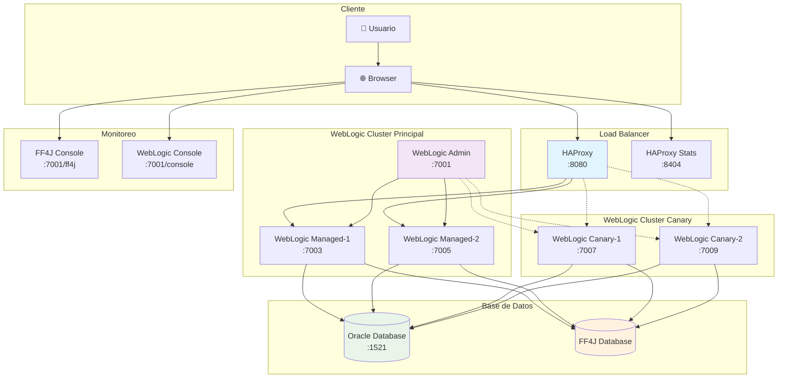
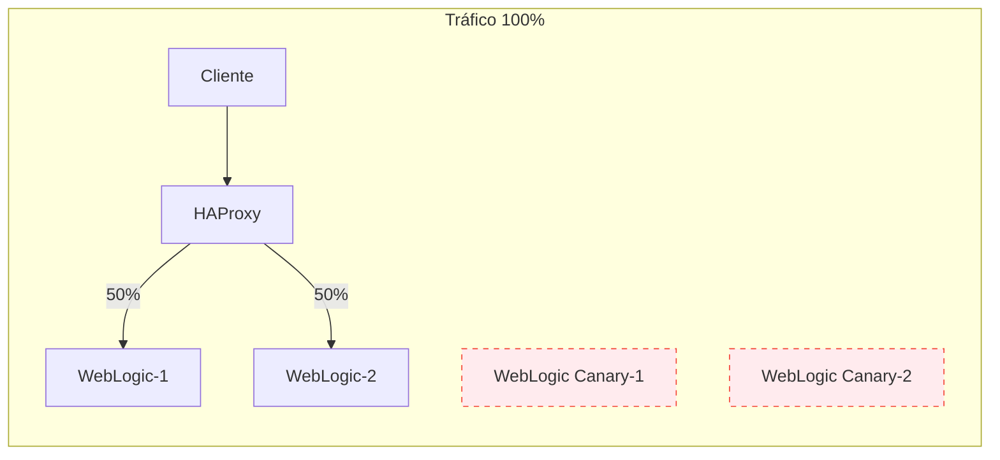
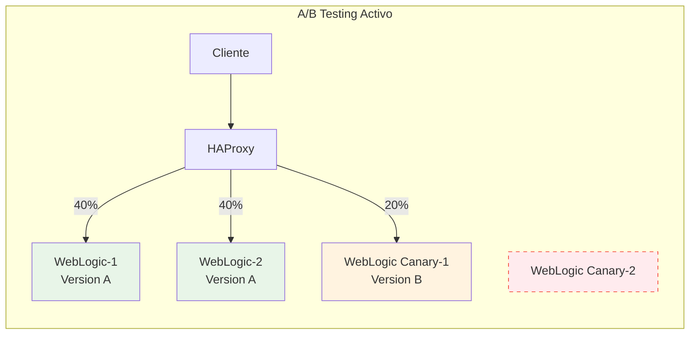
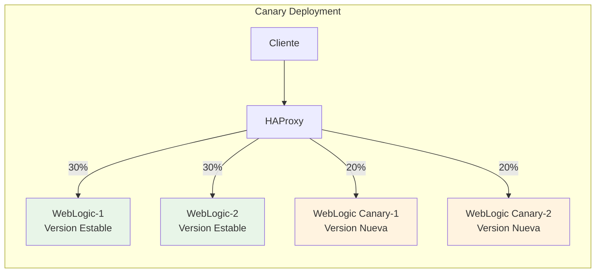
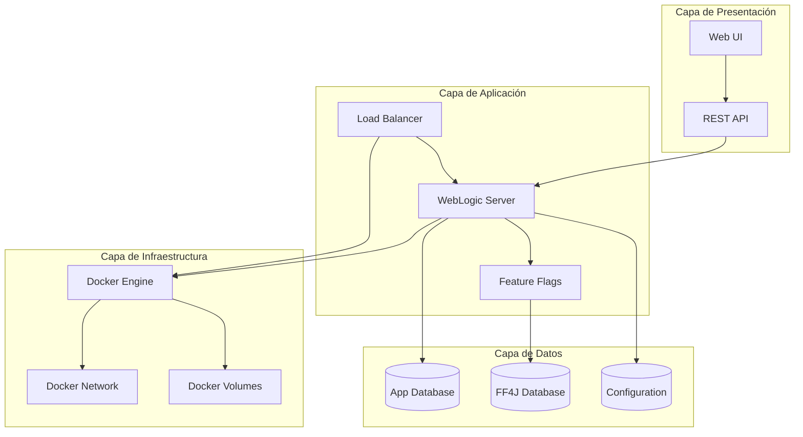
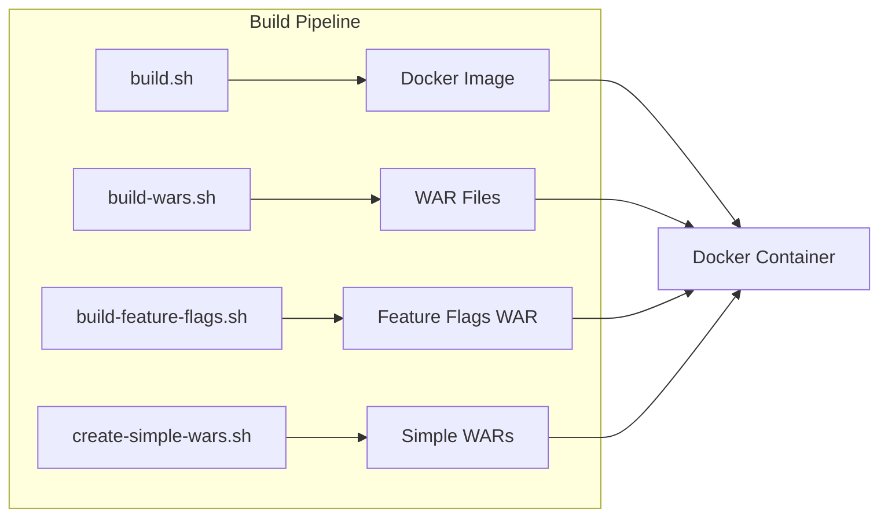
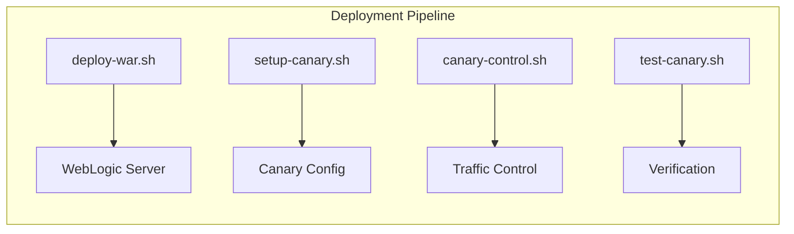
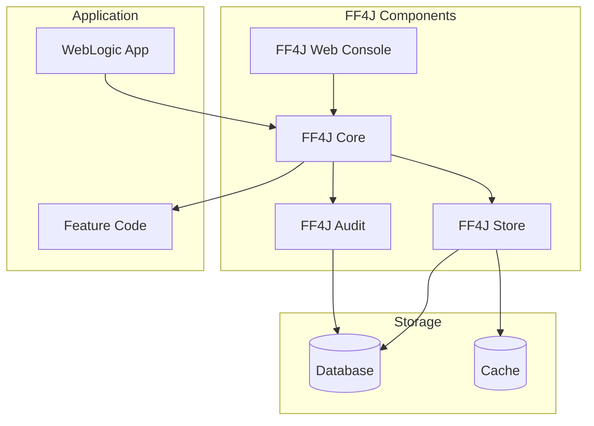

# Arquitectura del Sistema

Esta documentación describe la arquitectura completa del proyecto Docker Oracle WebLogic con soporte para despliegues canary, feature flags y balanceador de carga HAProxy.

## 🏗️ Vista General del Sistema



## 🔄 Flujo de Tráfico y Balanceado

### Modo Normal (Sin Canary)



### Modo A/B Testing



### Modo Canary Deployment



## 🏛️ Arquitectura de Componentes



## 📦 Estructura de Contenedores

| Contenedor | Puerto | Función | Estado |
|------------|--------|---------|--------|
| `weblogic-admin` | 7001 | Servidor de administración | Siempre activo |
| `weblogic-managed-1` | 7003 | Servidor principal 1 | Siempre activo |
| `weblogic-managed-2` | 7005 | Servidor principal 2 | Siempre activo |
| `weblogic-canary-1` | 7007 | Servidor canary 1 | Condicional |
| `weblogic-canary-2` | 7009 | Servidor canary 2 | Condicional |
| `haproxy-lb` | 8080, 8404 | Load balancer | Siempre activo |
| `oracle-db` | 1521 | Base de datos | Siempre activo |

## 🔧 Configuración de HAProxy

### Algoritmos de Balanceado

```haproxy
backend weblogic_main
    balance roundrobin
    option httpchk GET /health
    server weblogic-1 weblogic-managed-1:7003 check
    server weblogic-2 weblogic-managed-2:7005 check

backend weblogic_canary
    balance roundrobin
    option httpchk GET /health
    server canary-1 weblogic-canary-1:7007 check
    server canary-2 weblogic-canary-2:7009 check
```

### Reglas de Enrutamiento

```haproxy
frontend weblogic_frontend
    bind *:8080
    
    # A/B Testing basado en cookies
    acl is_beta_user hdr_sub(cookie) beta=true
    use_backend weblogic_canary if is_beta_user
    
    # Canary deployment basado en porcentaje
    acl canary_traffic rand(100) lt 20
    use_backend weblogic_canary if canary_traffic
    
    default_backend weblogic_main
```

## 🚀 Scripts de Automatización

### Scripts de Construcción



### Scripts de Despliegue



## 🔍 Feature Flags con FF4J

### Arquitectura FF4J



### Estados de Feature Flags

| Estado | Descripción | Tráfico |
|--------|-------------|---------|
| `ENABLED` | Feature activo para todos | 100% |
| `DISABLED` | Feature desactivado | 0% |
| `CANARY` | Feature en pruebas | Configurable |
| `A_B_TEST` | Pruebas A/B activas | Split configurable |

## 📊 Monitoreo y Observabilidad

### Métricas Disponibles

- **HAProxy Stats**: Estadísticas de balanceado en tiempo real
- **WebLogic Metrics**: JVM, threads, conexiones
- **FF4J Audit**: Uso de feature flags
- **Application Logs**: Logs centralizados

### Dashboards

1. **HAProxy Dashboard** (`http://localhost:8404/stats`)
   - Estado de backends
   - Distribución de tráfico
   - Health checks

2. **WebLogic Console** (`http://localhost:7001/console`)
   - Estado del cluster
   - Aplicaciones desplegadas
   - Configuración del dominio

3. **FF4J Console** (`http://localhost:7001/ff4j-web-console`)
   - Gestión de feature flags
   - Auditoría de uso
   - Configuración de estrategias

## 🔐 Seguridad

### Configuración de Seguridad

- **WebLogic Security**: Autenticación y autorización
- **HAProxy SSL**: Terminación SSL/TLS
- **Database Security**: Conexiones cifradas
- **Network Security**: Redes Docker aisladas

### Credenciales por Defecto

!!! warning "Cambiar en Producción"
    Estas credenciales deben cambiarse antes del despliegue en producción.

| Servicio | Usuario | Contraseña |
|----------|---------|------------|
| WebLogic Admin | `weblogic` | `welcome1` |
| HAProxy Stats | `admin` | `admin` |
| Oracle DB | `system` | `oracle` |

## 🔄 Flujos de Despliegue

### Despliegue Normal

1. Build de la aplicación
2. Creación del WAR
3. Despliegue en cluster principal
4. Verificación de health checks
5. Activación del tráfico

### Despliegue Canary

1. Build de la nueva versión
2. Despliegue en cluster canary
3. Configuración de porcentaje de tráfico
4. Monitoreo de métricas
5. Promoción o rollback

### A/B Testing

1. Configuración de feature flags
2. Definición de criterios de segmentación
3. Activación de pruebas
4. Recolección de métricas
5. Análisis de resultados
