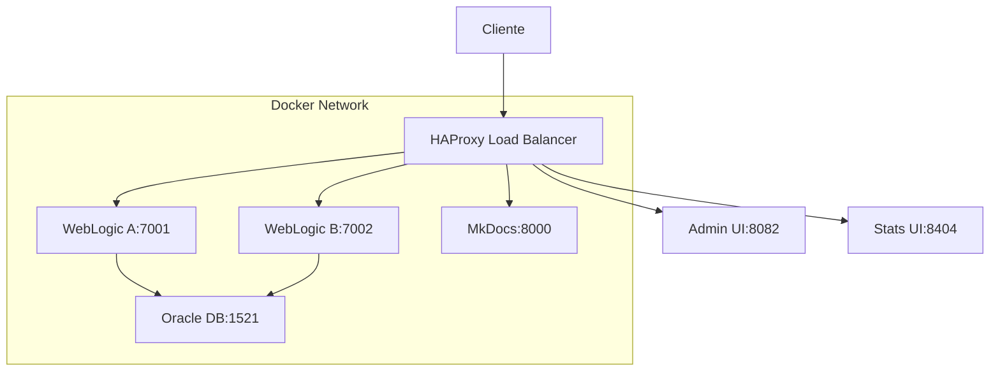

# 🏗️ Arquitectura del Sistema

## Visión General

El proyecto Docker Oracle WebLogic implementa una arquitectura moderna basada en contenedores con capacidades de despliegue canary y balanceador de carga avanzado.

## Componentes Principales

### 1. WebLogic Servers
- **WebLogic A**: Servidor principal en puerto 7001
- **WebLogic B**: Servidor secundario en puerto 7002
- Configuración para despliegues canary A/B

### 2. Oracle Database
- **Oracle Express 21c**: Base de datos en puerto 1521
- Health checks automáticos
- Persistencia de datos

### 3. HAProxy Load Balancer
- **Puertos**: 8081-8404 (múltiples interfaces)
- **Admin UI**: Puerto 8082
- **Stats UI**: Puerto 8404
- Balanceador inteligente con health checks

### 4. MkDocs Documentation
- **Puerto**: 8000
- Documentación en tiempo real
- Integración con HAProxy

## Diagrama de Arquitectura

## Redes Docker

### Red Principal: `weblogic-haproxy_weblogic-network`
- Todos los servicios principales
- Comunicación interna entre contenedores
- Resolución DNS automática

## Puertos Expuestos

| Servicio | Puerto Interno | Puerto Externo | Descripción |
|----------|----------------|----------------|-------------|
| WebLogic A | 7001 | 7001 | Servidor principal |
| WebLogic B | 7002 | 7002 | Servidor secundario |
| Oracle DB | 1521 | 1521 | Base de datos |
| HAProxy LB | 80 | 8083 | Load balancer |
| HAProxy Admin | 8082 | 8082 | Interfaz admin |
| HAProxy Stats | 8404 | 8404 | Estadísticas |
| HAProxy HTTPS | 443 | 8444 | HTTPS |
| MkDocs | 8000 | 8000 | Documentación |

## Características Avanzadas

### Despliegues Canary
- Distribución de tráfico configurable
- Rollback automático
- Monitoreo en tiempo real

### Health Checks
- Verificación automática de servicios
- Failover inteligente
- Alertas de estado

### Balanceador de Carga
- Algoritmos de balanceo configurables
- Sticky sessions
- SSL termination

## Seguridad

### Autenticación
- HAProxy Admin: `admin:admin123`
- Acceso controlado a interfaces administrativas

### Red
- Aislamiento de contenedores
- Comunicación interna segura
- Exposición controlada de puertos

## Monitoreo

### Métricas Disponibles
- Estado de servicios
- Tráfico de red
- Performance de aplicaciones
- Logs centralizados

### Interfaces de Monitoreo
- HAProxy Stats UI
- Admin Dashboard
- Logs de contenedores

## Escalabilidad

### Horizontal
- Múltiples instancias WebLogic
- Balanceador automático
- Distribución de carga

### Vertical
- Recursos configurables por contenedor
- Límites de memoria y CPU
- Optimización automática

---

Para más detalles técnicos, consulta:
- [Guía de Despliegue](deployment/basic-deployment.md)
- [Configuración HAProxy](guides/haproxy-setup.md)
- [Troubleshooting](guides/troubleshooting.md)
