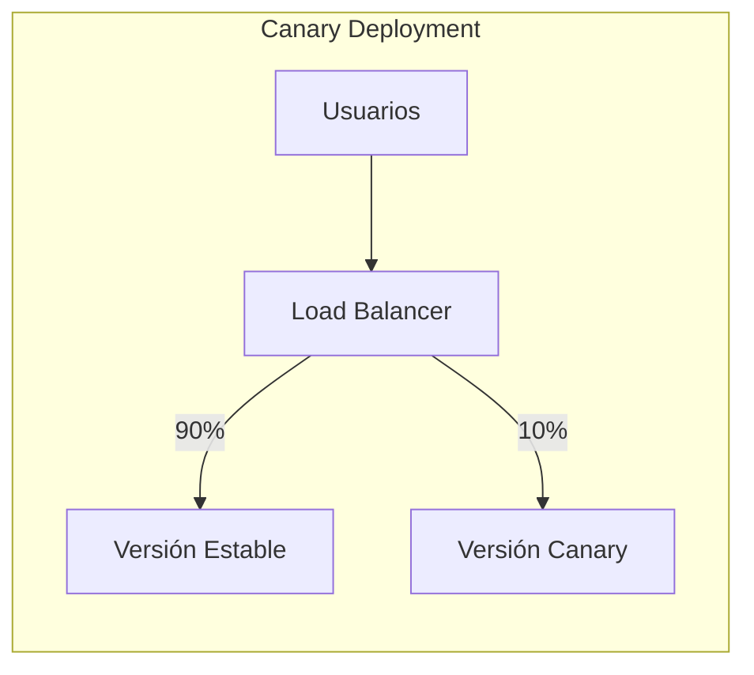

# Canary Deployment y Feature Flags

Esta guía cubre los despliegues canary y la gestión de feature flags para implementar nuevas funcionalidades de forma segura y controlada.

## 🎯 Canary Deployment

### ¿Qué es Canary Deployment?

El despliegue canary permite probar una nueva versión de tu aplicación con un pequeño porcentaje de usuarios antes de hacer el despliegue completo, reduciendo el riesgo de errores en producción.



### Configuración Inicial

```bash
# 1. Configurar servidores canary
./setup-canary.sh

# 2. Verificar configuración
docker-compose ps | grep canary
```

### Flujo Completo de Canary

#### 1. Preparar Nueva Versión

```bash
# Construir nueva versión
cd war-projects/myapp
mvn clean package

# Crear imagen canary
docker build -t myapp:canary .
```

#### 2. Desplegar en Canary

```bash
# Desplegar solo en servidores canary
./deploy-war.sh myapp-v2.war canary

# Verificar despliegue canary
curl http://weblogic-canary-1:7007/myapp/health
curl http://weblogic-canary-2:7009/myapp/health
```

#### 3. Configurar Tráfico

```bash
# Dirigir 10% del tráfico a canary
./canary-control.sh set 10

# Verificar distribución
./canary-control.sh status
```

#### 4. Monitorear y Ajustar

```bash
# Monitorear métricas
curl http://localhost:8404/stats | grep canary

# Aumentar tráfico gradualmente
./canary-control.sh set 25   # 25%
./canary-control.sh set 50   # 50%

# Ver logs de ambas versiones
docker-compose logs weblogic-managed-1 | tail -50
docker-compose logs weblogic-canary-1 | tail -50
```

#### 5. Promover o Rollback

```bash
# Si todo va bien: promover
./canary-control.sh promote

# Si hay problemas: rollback
./canary-control.sh rollback

# Desactivar canary
./canary-control.sh set 0
```

### Configuración Avanzada de Canary

#### Canary por Headers

```bash
# Configurar canary para usuarios específicos
# En haproxy.cfg
acl is_beta_user hdr_sub(cookie) beta=true
use_backend weblogic_canary if is_beta_user
```

#### Canary por Geolocalización

```bash
# Canary para región específica
acl is_us_user hdr_sub(x-forwarded-for) 192.168.1
use_backend weblogic_canary if is_us_user
```

#### Canary Programado

```bash
# Script para canary automático
#!/bin/bash
# auto-canary.sh

# Desplegar canary
./deploy-war.sh myapp-v2.war canary

# Incrementar tráfico gradualmente
for percent in 5 10 25 50 75; do
    ./canary-control.sh set $percent
    echo "Canary al $percent%, esperando 10 minutos..."
    sleep 600
    
    # Verificar métricas
    if ! ./scripts/monitoring/check-health.sh; then
        echo "Problemas detectados, ejecutando rollback"
        ./canary-control.sh rollback
        exit 1
    fi
done

# Promover si todo está bien
./canary-control.sh promote
```

## 🚩 Feature Flags con FF4J

### Configuración de FF4J

#### Instalación y Setup

```bash
# Desplegar aplicación FF4J
./deploy-war.sh war-projects/feature-flags/target/feature-flags.war

# Verificar consola FF4J
curl http://localhost:7001/ff4j-web-console
```

#### Configuración de Base de Datos

```sql
-- Crear tablas FF4J
CREATE TABLE FF4J_FEATURES (
    FEAT_UID VARCHAR2(100) NOT NULL,
    ENABLE NUMBER(1) NOT NULL,
    DESCRIPTION VARCHAR2(1000),
    STRATEGY VARCHAR2(1000),
    EXPRESSION VARCHAR2(255),
    GROUPNAME VARCHAR2(100),
    PRIMARY KEY(FEAT_UID)
);

CREATE TABLE FF4J_PROPERTIES (
    PROPERTY_ID VARCHAR2(100) NOT NULL,
    CLAZZ VARCHAR2(255) NOT NULL,
    CURRENTVALUE VARCHAR2(255),
    FIXEDVALUES VARCHAR2(1000),
    DESCRIPTION VARCHAR2(255),
    FEAT_UID VARCHAR2(100),
    PRIMARY KEY(PROPERTY_ID)
);
```

### Uso de Feature Flags en Código

#### Configuración Java

```java
@Configuration
public class FF4JConfig {
    
    @Bean
    public FF4j ff4j() {
        FF4j ff4j = new FF4j();
        
        // Configurar store JDBC
        JdbcFeatureStore featureStore = new JdbcFeatureStore();
        featureStore.setDataSource(dataSource());
        ff4j.setFeatureStore(featureStore);
        
        // Habilitar auditoría
        ff4j.setEnableAudit(true);
        
        return ff4j;
    }
}
```

#### Uso en Controladores

```java
@RestController
public class MyController {
    
    @Autowired
    private FF4j ff4j;
    
    @GetMapping("/api/data")
    public ResponseEntity<?> getData() {
        
        if (ff4j.check("NEW_DATA_FORMAT")) {
            // Nueva funcionalidad
            return ResponseEntity.ok(getDataV2());
        } else {
            // Funcionalidad existente
            return ResponseEntity.ok(getDataV1());
        }
    }
    
    @GetMapping("/api/feature")
    public ResponseEntity<?> getFeature() {
        
        // Feature flag con estrategia de porcentaje
        if (ff4j.check("BETA_FEATURE")) {
            return ResponseEntity.ok("Beta feature enabled!");
        }
        
        return ResponseEntity.ok("Standard feature");
    }
}
```

#### Uso en Templates

```html
<!-- Thymeleaf -->
<div th:if="${@ff4j.check('SHOW_NEW_UI')}">
    <h2>Nueva Interfaz</h2>
    <!-- Nuevo contenido -->
</div>

<div th:unless="${@ff4j.check('SHOW_NEW_UI')}">
    <h2>Interfaz Clásica</h2>
    <!-- Contenido existente -->
</div>
```

### Gestión de Feature Flags

#### Consola Web FF4J

Accede a `http://localhost:7001/ff4j-web-console` para:

- ✅ Activar/desactivar features
- 📊 Ver estadísticas de uso
- 👥 Configurar estrategias de usuario
- 📈 Monitorear rendimiento

#### API REST

```bash
# Listar todas las features
curl http://localhost:7001/ff4j-web-console/api/ff4j/store/features

# Activar feature
curl -X POST http://localhost:7001/ff4j-web-console/api/ff4j/store/features/MY_FEATURE/enable

# Desactivar feature
curl -X POST http://localhost:7001/ff4j-web-console/api/ff4j/store/features/MY_FEATURE/disable

# Crear nueva feature
curl -X POST http://localhost:7001/ff4j-web-console/api/ff4j/store/features \
  -H "Content-Type: application/json" \
  -d '{
    "uid": "NEW_FEATURE",
    "enable": false,
    "description": "Nueva funcionalidad experimental"
  }'
```

#### Estrategias Avanzadas

```java
// Estrategia por porcentaje
Feature feature = new Feature("GRADUAL_ROLLOUT");
feature.setFlippingStrategy(new PonderationStrategy(0.25)); // 25%

// Estrategia por tiempo
Feature timedFeature = new Feature("TIMED_FEATURE");
timedFeature.setFlippingStrategy(
    new ReleaseDateFlippingStrategy("2024-12-01-14:00")
);

// Estrategia por usuario
Feature userFeature = new Feature("USER_SPECIFIC");
userFeature.setFlippingStrategy(
    new ClientFilterStrategy("user1,user2,user3")
);
```

## 🔄 Integración Canary + Feature Flags

### Despliegue Híbrido

```bash
# 1. Desplegar nueva versión con feature flag desactivada
./deploy-war.sh myapp-v2.war

# 2. Activar feature flag solo para canary
curl -X POST http://localhost:7001/ff4j-web-console/api/ff4j/store/features/NEW_FEATURE/enable

# 3. Configurar canary con header específico
# En haproxy.cfg:
# acl has_beta_flag hdr_sub(cookie) ff4j_NEW_FEATURE=true
# use_backend weblogic_canary if has_beta_flag
```

### A/B Testing Completo

```java
@RestController
public class ABTestController {
    
    @Autowired
    private FF4j ff4j;
    
    @GetMapping("/api/experiment")
    public ResponseEntity<?> experiment(HttpServletRequest request) {
        
        String userId = request.getHeader("X-User-ID");
        
        // Estrategia A/B basada en user ID
        if (ff4j.check("AB_TEST_FEATURE", 
                      new FlippingExecutionContext("userId", userId))) {
            
            // Versión B
            return ResponseEntity.ok(getExperimentalFeature());
        } else {
            // Versión A (control)
            return ResponseEntity.ok(getStandardFeature());
        }
    }
}
```

## 📊 Monitoreo y Métricas

### Métricas de Canary

```bash
# Script de monitoreo
#!/bin/bash
# monitor-canary.sh

while true; do
    echo "=== $(date) ==="
    
    # Tráfico por backend
    curl -s http://localhost:8404/stats | grep -E "(main|canary)" | \
        awk '{print $1 ": " $8 " requests"}'
    
    # Errores por backend
    curl -s http://localhost:8404/stats | grep -E "(main|canary)" | \
        awk '{print $1 ": " $14 " errors"}'
    
    # Tiempo de respuesta
    curl -w "Response time: %{time_total}s\n" -s -o /dev/null http://localhost:8080/myapp/health
    
    sleep 30
done
```

### Métricas de Feature Flags

```java
// Métricas personalizadas
@Component
public class FeatureFlagMetrics {
    
    @Autowired
    private FF4j ff4j;
    
    @Scheduled(fixedRate = 60000) // Cada minuto
    public void collectMetrics() {
        
        Map<String, Feature> features = ff4j.getFeatures();
        
        for (Feature feature : features.values()) {
            boolean enabled = feature.isEnable();
            long usageCount = ff4j.getEventRepository()
                .getFeatureUsageHitCount(feature.getUid());
            
            // Enviar métricas a sistema de monitoreo
            sendMetric("feature.enabled", feature.getUid(), enabled ? 1 : 0);
            sendMetric("feature.usage", feature.getUid(), usageCount);
        }
    }
}
```

## 🚨 Rollback y Recuperación

### Rollback Automático

```bash
#!/bin/bash
# auto-rollback.sh

HEALTH_ENDPOINT="http://localhost:8080/myapp/health"
ERROR_THRESHOLD=5
CONSECUTIVE_ERRORS=0

while true; do
    if ! curl -f $HEALTH_ENDPOINT > /dev/null 2>&1; then
        CONSECUTIVE_ERRORS=$((CONSECUTIVE_ERRORS + 1))
        echo "Error detectado ($CONSECUTIVE_ERRORS/$ERROR_THRESHOLD)"
        
        if [ $CONSECUTIVE_ERRORS -ge $ERROR_THRESHOLD ]; then
            echo "Ejecutando rollback automático..."
            ./canary-control.sh rollback
            break
        fi
    else
        CONSECUTIVE_ERRORS=0
    fi
    
    sleep 10
done
```

### Rollback de Feature Flags

```bash
# Desactivar feature problemática
curl -X POST http://localhost:7001/ff4j-web-console/api/ff4j/store/features/PROBLEMATIC_FEATURE/disable

# Rollback masivo de features
./scripts/ff4j/rollback-features.sh "EXPERIMENTAL_*"
```

## 📋 Mejores Prácticas

### Canary Deployment
- Empieza con porcentajes bajos (5-10%)
- Incrementa gradualmente
- Monitorea métricas clave constantemente
- Ten plan de rollback preparado
- Documenta criterios de éxito/fallo

### Feature Flags
- Usa nombres descriptivos para flags
- Documenta propósito y duración esperada
- Limpia flags obsoletas regularmente
- No uses para cambios de configuración
- Considera impacto en rendimiento

### Monitoreo
- Configura alertas automáticas
- Monitorea tanto métricas técnicas como de negocio
- Usa dashboards en tiempo real
- Registra todas las decisiones de rollout
- Analiza resultados post-despliegue
