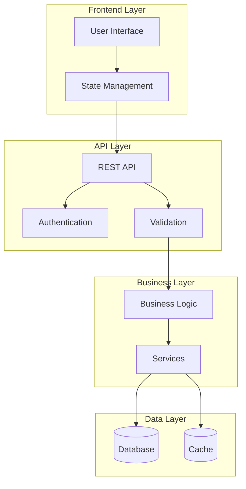

# Arquitectura - poc-icbs

## 🏗️ Visión General

Integration service for ICBS (Integrated Core Banking System)

## 📊 Diagrama de Arquitectura

## 🔧 Componentes

### Frontend
- **Framework**: React/Vue/Angular
- **State Management**: Redux/Vuex/NgRx
- **Routing**: React Router/Vue Router/Angular Router

### Backend
- **Framework**: Express.js/Fastify/NestJS
- **Authentication**: JWT/OAuth2
- **Validation**: Joi/Yup/class-validator

### Base de Datos
- **Tipo**: PostgreSQL/MySQL/MongoDB
- **ORM**: Prisma/TypeORM/Mongoose
- **Migraciones**: Automáticas

### Cache
- **Redis**: Para sesiones y cache
- **Memoria**: Para datos frecuentes

## 🔄 Flujo de Datos

1. **Request**: Cliente envía petición
2. **Authentication**: Verificación de credenciales
3. **Validation**: Validación de datos
4. **Business Logic**: Procesamiento de negocio
5. **Data Access**: Acceso a base de datos
6. **Response**: Respuesta al cliente

## 🛡️ Seguridad

- **HTTPS**: Comunicación encriptada
- **JWT**: Tokens de autenticación
- **CORS**: Control de acceso
- **Rate Limiting**: Limitación de requests
- **Input Validation**: Validación de entrada

## 📈 Escalabilidad

- **Horizontal**: Múltiples instancias
- **Load Balancer**: Distribución de carga
- **Database Sharding**: Particionado de datos
- **Caching**: Optimización de performance

## 🔍 Monitoreo

- **Logs**: Structured logging
- **Metrics**: Prometheus/Grafana
- **Tracing**: Jaeger/Zipkin
- **Health Checks**: Endpoints de salud
