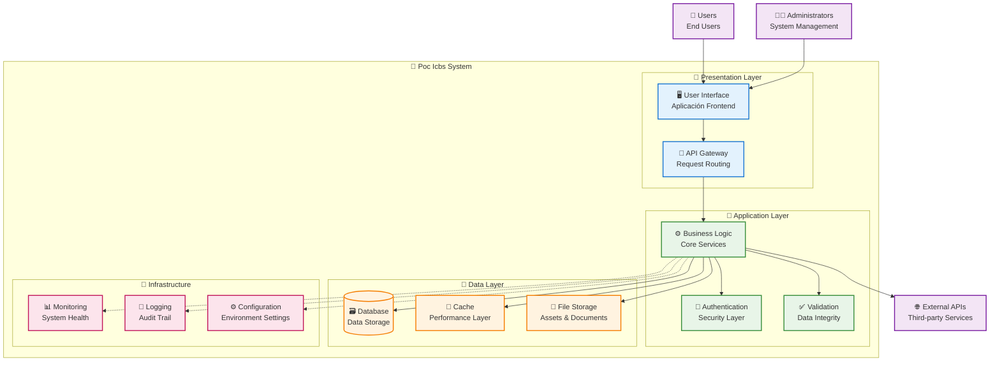

ℹ️  Generando arquitectura avanzada para: Poc Icbs (Aplicación)
# Arquitectura - Poc Icbs

## 🏗️ Visión General

Poc Icbs es una aplicación service desarrollada con Aplicación que implementa una arquitectura moderna y escalable.

## 📊 Diagrama de Arquitectura

## 🔧 Componentes Principales

### 🎨 Capa de Presentación
- **Interfaz de Usuario**: Desarrollada con Aplicación
- **API Gateway**: Punto de entrada único para requests
- **Routing**: Enrutamiento y navegación

### 🧠 Capa de Aplicación
- **Lógica de Negocio**: Procesamiento de reglas empresariales
- **Autenticación**: Gestión de usuarios y permisos
- **Validación**: Verificación de integridad de datos

### 💾 Capa de Datos
- **Base de Datos**: Almacenamiento persistente de información
- **Cache**: Optimización de rendimiento
- **Almacenamiento**: Gestión de archivos y assets

### 🔧 Infraestructura
- **Monitoreo**: Supervisión de salud del sistema
- **Logging**: Registro de eventos y auditoría
- **Configuración**: Gestión de entornos y settings

## 🚀 Características Técnicas

### ⚡ Performance
- Optimización de consultas y cache
- Compresión de assets y recursos
- Lazy loading de componentes

### 🛡️ Seguridad
- Autenticación y autorización robusta
- Validación de entrada de datos
- Protección contra vulnerabilidades comunes

### 📊 Escalabilidad
- Arquitectura modular y desacoplada
- Capacidad de escalado horizontal
- Gestión eficiente de recursos

## 🔍 Monitoreo y Mantenimiento

### 📈 Métricas Clave
- Tiempo de respuesta de endpoints
- Uso de recursos del sistema
- Tasa de errores y disponibilidad

### 🐛 Debugging y Logs
- Logging estructurado y centralizado
- Trazabilidad de requests
- Alertas automáticas de errores
