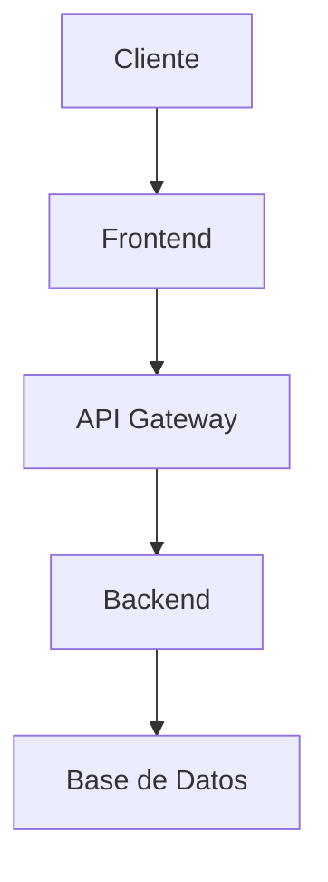

# Arquitectura

## 🏗️ Visión General

Descripción de la arquitectura de POC ICBS.

## 🔧 Componentes

### Frontend
- Tecnología: React/Angular/Vue
- Puerto: 3000

### Backend
- Tecnología: Node.js/Java/Python
- Puerto: 8080

### Base de Datos
- Tecnología: PostgreSQL/MySQL/MongoDB
- Puerto: 5432

## 📊 Diagramas

