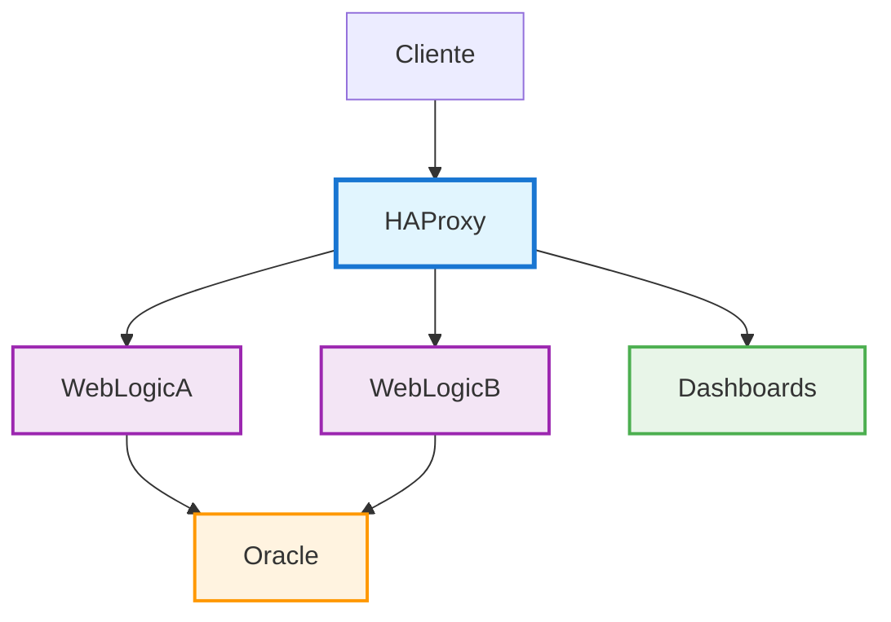
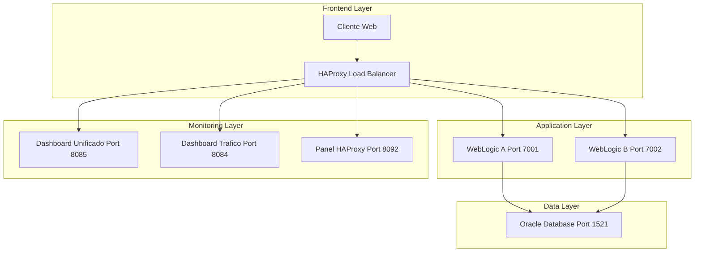
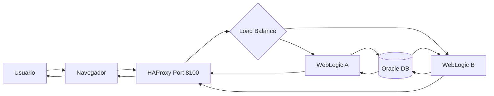
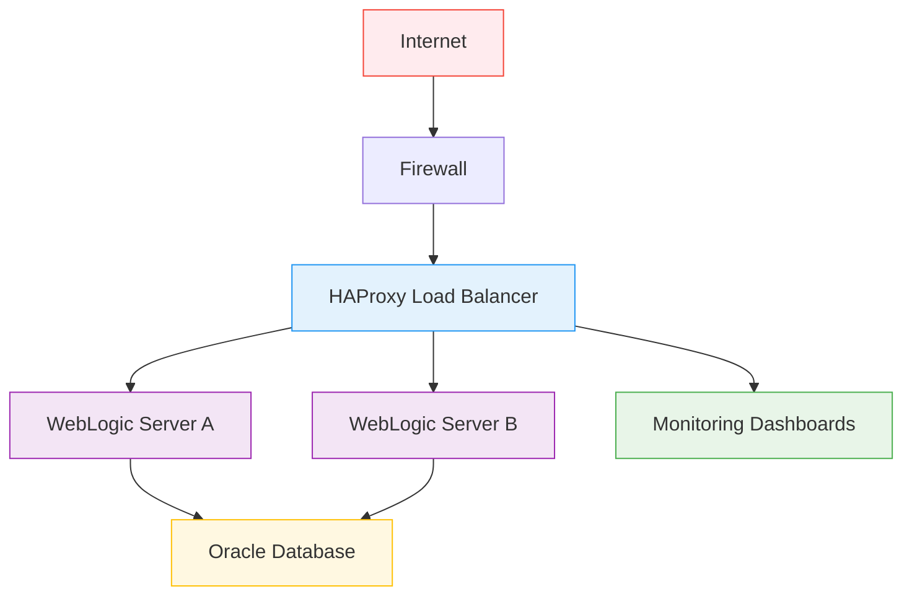
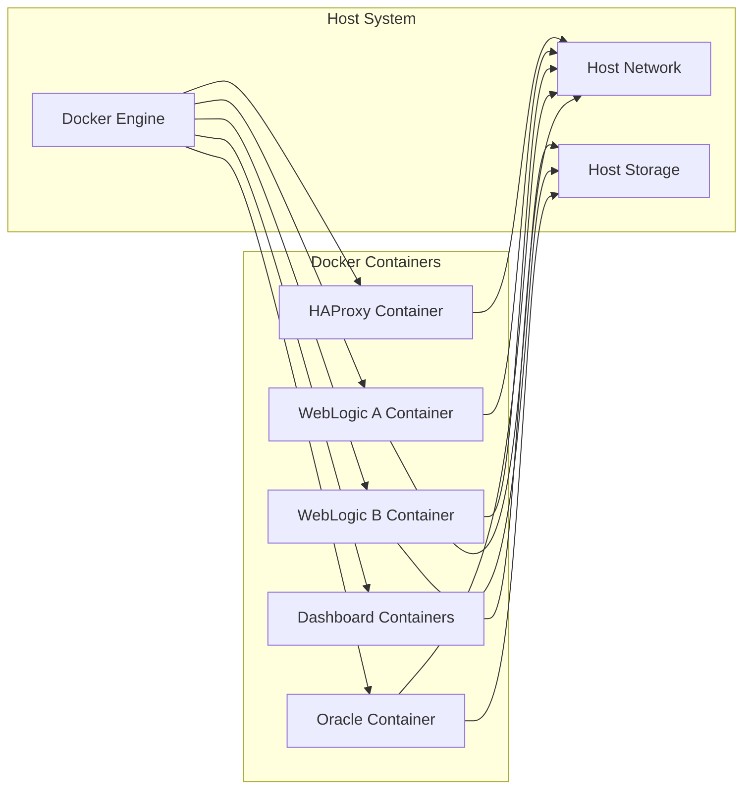
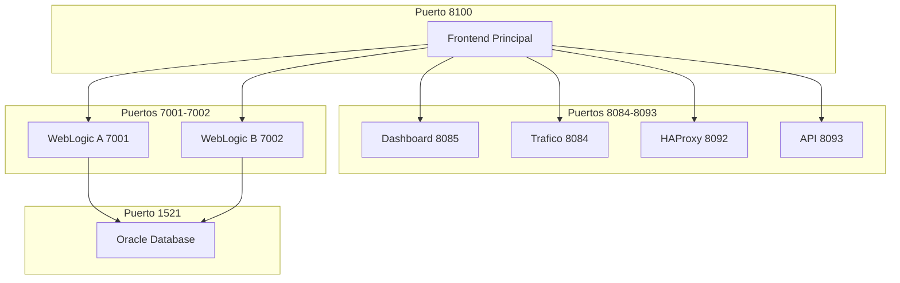

# 🏗️ Diagramas de Arquitectura

## Arquitectura Principal - Versión Simple

## Arquitectura Detallada - Con Puertos

## Flujo de Datos

## Arquitectura de Red

## Diagrama de Componentes

## Puertos y Servicios

