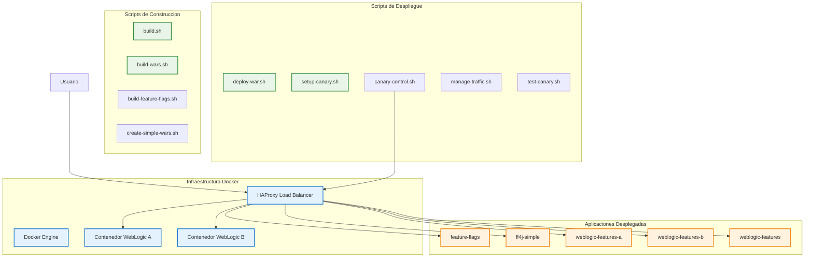
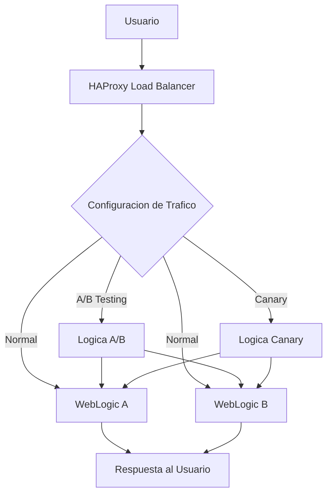
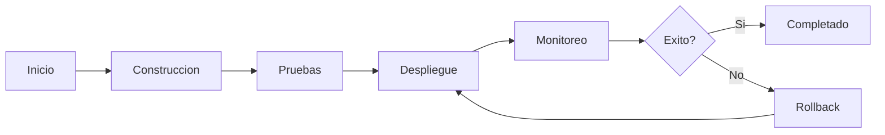
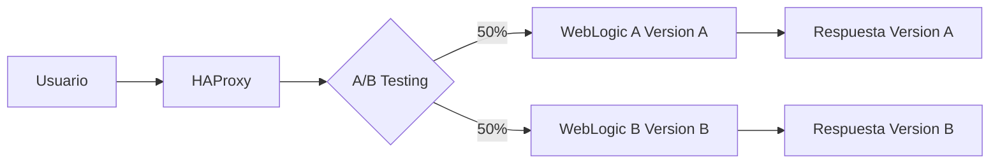
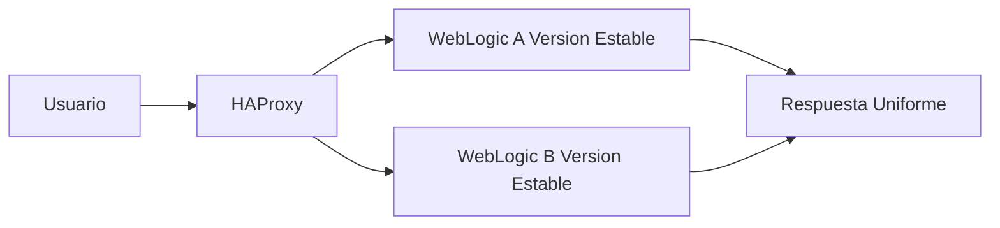
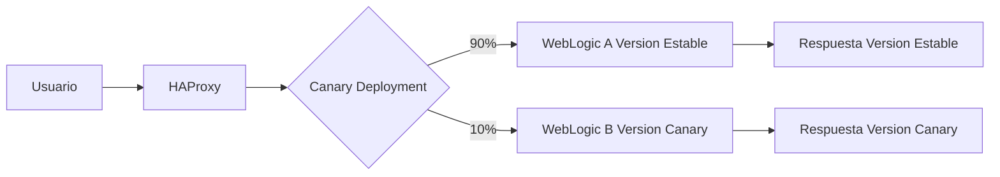
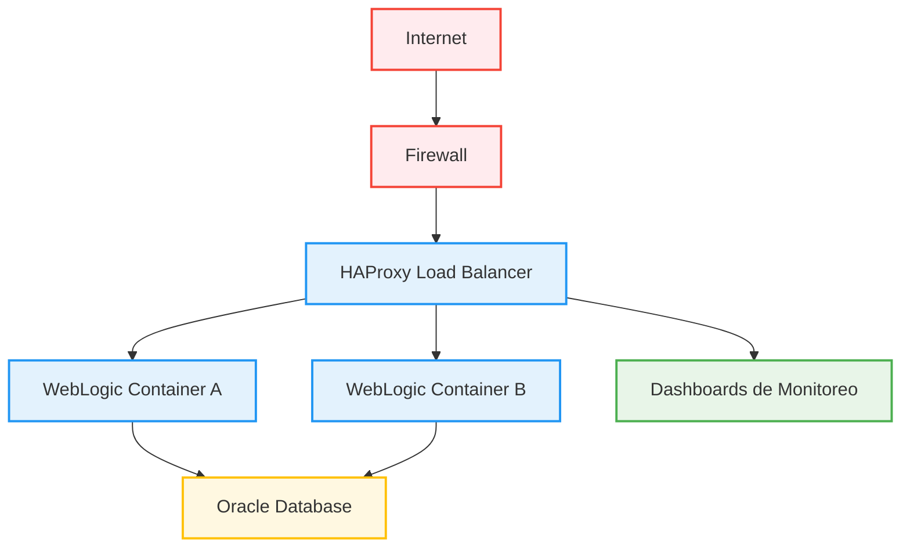

# Arquitectura Mejorada del Proyecto Docker para Oracle WebLogic

## Diagrama de Arquitectura General

## Componentes Principales

### 🐳 Infraestructura Docker
- **Docker Engine**: Motor de contenedores
- **HAProxy**: Load balancer y proxy reverso
- **WebLogic A/B**: Servidores de aplicaciones en contenedores

### 📜 Scripts de Construcción
- **build.sh**: Script principal de construcción
- **build-wars.sh**: Construcción de archivos WAR
- **build-feature-flags.sh**: Construcción específica para feature flags
- **create-simple-wars.sh**: Creación de WARs simples

### 🚀 Scripts de Despliegue
- **deploy-war.sh**: Despliegue de aplicaciones WAR
- **setup-canary.sh**: Configuración de despliegue canary
- **canary-control.sh**: Control del tráfico canary
- **manage-traffic.sh**: Gestión general del tráfico
- **test-canary.sh**: Pruebas del despliegue canary

## Diagrama de Flujo de Tráfico

## Flujo de Despliegue

## Diagrama de Testing A/B (Cuando está activo)

### Características del Testing A/B Activo:
- **Distribución**: 50% del tráfico a cada versión
- **Métricas**: Recolección de datos de rendimiento
- **Comparación**: Análisis de resultados entre versiones

## Diagrama de Testing A/B (Cuando está inactivo)

### Características del Testing A/B Inactivo:
- **Distribución**: Tráfico normal balanceado
- **Versiones**: Ambas instancias ejecutan la misma versión
- **Estabilidad**: Comportamiento predecible y uniforme

## Diagrama de Canary Deployment (Cuando está activo)

### Características del Canary Deployment Activo:
- **Distribución**: 90% tráfico estable, 10% canary
- **Riesgo**: Minimizado al exponer solo una pequeña porción
- **Monitoreo**: Vigilancia intensiva de la versión canary

## Diagrama de Canary Deployment (Cuando está inactivo)

### Características del Canary Deployment Inactivo:
- **Distribución**: Tráfico normal balanceado
- **Versiones**: Ambas instancias ejecutan la versión estable
- **Operación**: Funcionamiento normal sin experimentación

## Arquitectura de Red

## Beneficios de esta Arquitectura

### 🎯 Flexibilidad
- **Despliegues graduales**: Canary deployment para reducir riesgos
- **Testing A/B**: Comparación de versiones en producción
- **Feature flags**: Control granular de funcionalidades

### 🛡️ Confiabilidad
- **Load balancing**: Distribución de carga entre instancias
- **Rollback rápido**: Capacidad de revertir cambios problemáticos
- **Monitoreo**: Supervisión continua del rendimiento

### 🚀 Escalabilidad
- **Contenedores**: Fácil escalado horizontal
- **Microservicios**: Arquitectura preparada para crecimiento
- **Automatización**: Scripts para operaciones repetitivas

Esta arquitectura mejorada proporciona una base sólida para el desarrollo, testing y despliegue de aplicaciones empresariales con Oracle WebLogic.
