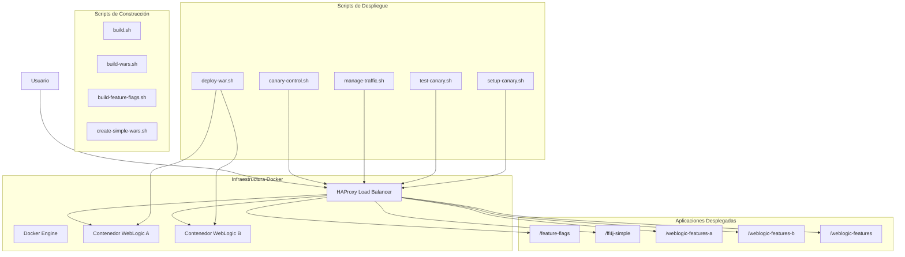

# Arquitectura Mejorada del Proyecto Docker para Oracle WebLogic

## Diagrama de Arquitectura General



## Diagrama de Flujo de Tráfico

```mermaid
flowchart TD
    User[Usuario] --> HAProxy[HAProxy Load Balancer]
    
    subgraph "Gestión de Tráfico"
        HAProxy --> FeatureFlags[Feature Flags]
        HAProxy --> ABTesting[A/B Testing]
        HAProxy --> CanaryDeployment[Canary Deployment]
    end
    
    subgraph "Backends"
        FeatureFlags --> FF[/feature-flags]
        FeatureFlags --> FF4J[/ff4j-simple]
        
        ABTesting --> ABDecision{¿A/B Testing Activo?}
        ABDecision -->|Sí| ABDistribution{Distribución A/B}
        ABDecision -->|No| VersionA[Version A]
        
        ABDistribution -->|Porcentaje A| VersionA[Version A]
        ABDistribution -->|Porcentaje B| VersionB[Version B]
        
        CanaryDeployment --> CanaryDecision{¿Canary Activo?}
        CanaryDecision -->|Sí| CanaryDistribution{Distribución Canary}
        CanaryDecision -->|No| WeblogicFeaturesA[/weblogic-features-a]
        
        CanaryDistribution -->|Porcentaje A| WeblogicFeaturesA[/weblogic-features-a]
        CanaryDistribution -->|Porcentaje B| WeblogicFeaturesB[/weblogic-features-b]
    end
    
    subgraph "Servidores"
        FF --> WebLogicA
        FF4J --> WebLogicA
        
        VersionA --> WebLogicA
        VersionB --> WebLogicB
        
        WeblogicFeaturesA --> WebLogicA
        WeblogicFeaturesB --> WebLogicB
    end
    
    %% Estilo para destacar el flujo de tráfico
    classDef active fill:#90EE90,stroke:#006400,stroke-width:2px
    classDef inactive fill:#FFB6C1,stroke:#8B0000,stroke-width:1px
    classDef decision fill:#ADD8E6,stroke:#00008B,stroke-width:2px
    
    class ABDecision,CanaryDecision decision
```

## Diagrama de Testing A/B (Cuando está activo)

```mermaid
flowchart LR
    User[Usuario] --> HAProxy[HAProxy]
    
    HAProxy --> ABDecision{A/B Testing}
    
    ABDecision -->|Porcentaje A| WebLogicA[WebLogic A]
    ABDecision -->|Porcentaje B| WebLogicB[WebLogic B]
    
    WebLogicA --> VersionA[/version-a]
    WebLogicB --> VersionB[/version-b]
    
    %% Estilo para destacar el flujo activo
    classDef active fill:#90EE90,stroke:#006400,stroke-width:2px
    classDef inactive fill:#FFB6C1,stroke:#8B0000,stroke-width:1px
    
    class WebLogicA,WebLogicB,VersionA,VersionB active
```

## Diagrama de Testing A/B (Cuando está inactivo)

```mermaid
flowchart LR
    User[Usuario] --> HAProxy[HAProxy]
    
    HAProxy --> WebLogicA[WebLogic A]
    
    WebLogicA --> VersionA[/version-a]
    
    %% Nodos inactivos
    WebLogicB[WebLogic B]
    VersionB[/version-b]
    
    %% Estilo para destacar el flujo activo vs inactivo
    classDef active fill:#90EE90,stroke:#006400,stroke-width:2px
    classDef inactive fill:#FFB6C1,stroke:#8B0000,stroke-width:1px
    
    class WebLogicA,VersionA active
    class WebLogicB,VersionB inactive
```

## Diagrama de Canary Deployment (Cuando está activo)

```mermaid
flowchart LR
    User[Usuario] --> HAProxy[HAProxy]
    
    HAProxy --> CanaryDecision{Canary}
    
    CanaryDecision -->|Porcentaje A| WebLogicA[WebLogic A]
    CanaryDecision -->|Porcentaje B| WebLogicB[WebLogic B]
    
    WebLogicA --> FeaturesA[/weblogic-features-a]
    WebLogicB --> FeaturesB[/weblogic-features-b]
    
    %% Estilo para destacar el flujo activo
    classDef active fill:#90EE90,stroke:#006400,stroke-width:2px
    
    class WebLogicA,WebLogicB,FeaturesA,FeaturesB active
```

## Diagrama de Canary Deployment (Cuando está inactivo)

```mermaid
flowchart LR
    User[Usuario] --> HAProxy[HAProxy]
    
    HAProxy --> WebLogicA[WebLogic A]
    
    WebLogicA --> FeaturesA[/weblogic-features-a]
    
    %% Nodos inactivos
    WebLogicB[WebLogic B]
    FeaturesB[/weblogic-features-b]
    
    %% Estilo para destacar el flujo activo vs inactivo
    classDef active fill:#90EE90,stroke:#006400,stroke-width:2px
    classDef inactive fill:#FFB6C1,stroke:#8B0000,stroke-width:1px
    
    class WebLogicA,FeaturesA active
    class WebLogicB,FeaturesB inactive
```

## Descripción de la Arquitectura Mejorada

### Componentes Principales

1. **Infraestructura Docker**
   - Docker Engine: Motor de contenedores que ejecuta WebLogic y HAProxy
   - HAProxy: Balanceador de carga que gestiona el tráfico entre versiones
   - Contenedor WebLogic A: Instancia principal de Oracle WebLogic Server
   - Contenedor WebLogic B: Instancia secundaria para testing A/B y canary

2. **Gestión de Tráfico**
   - Feature Flags: Control de características mediante banderas
   - A/B Testing: Distribución de tráfico para pruebas comparativas
   - Canary Deployment: Despliegue gradual de nuevas versiones

3. **Flujos de Tráfico**
   - Cuando A/B Testing está activo: El tráfico se distribuye entre WebLogic A y B según el porcentaje configurado
   - Cuando A/B Testing está inactivo: Todo el tráfico va a WebLogic A, WebLogic B queda inactivo
   - Cuando Canary está activo: El tráfico se distribuye entre /weblogic-features-a y /weblogic-features-b
   - Cuando Canary está inactivo: Todo el tráfico va a /weblogic-features-a, /weblogic-features-b queda inactivo

4. **Control de Despliegue**
   - Los scripts de canary-control.sh y manage-traffic.sh permiten ajustar dinámicamente los porcentajes de tráfico
   - La configuración de HAProxy se actualiza automáticamente según estos ajustes
   - El sistema de Feature Flags permite activar/desactivar características específicas

### Ventajas de la Arquitectura

1. **Flexibilidad**: Permite cambiar dinámicamente la distribución del tráfico sin reiniciar los servicios
2. **Seguridad**: Facilita el rollback rápido en caso de problemas con nuevas versiones
3. **Testeo Gradual**: Permite exponer nuevas características a un porcentaje controlado de usuarios
4. **Monitoreo**: Incluye dashboard para visualizar el comportamiento de cada versión
