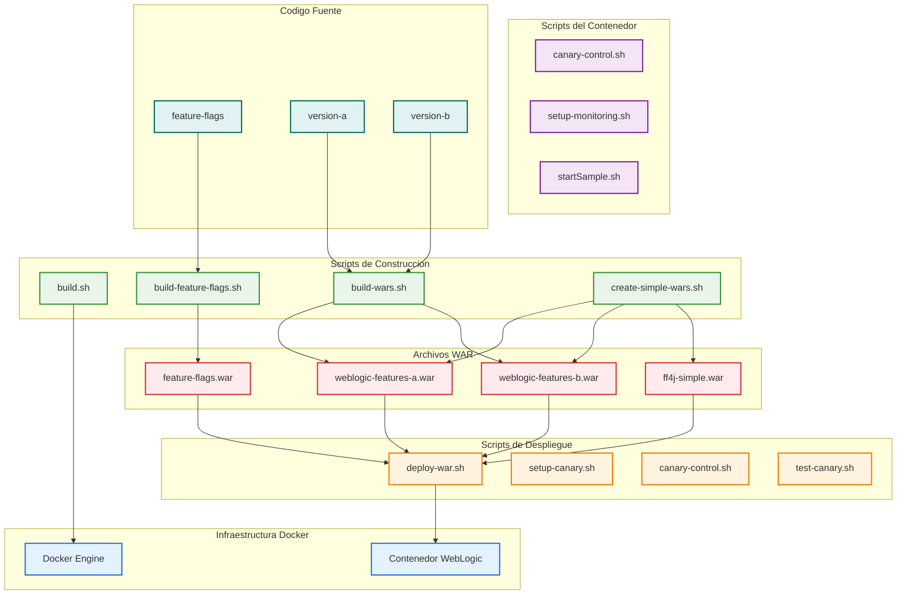

# Arquitectura del Proyecto Docker para Oracle WebLogic


    WebLogicFeaturesAWar --> DeployWarSh
    WebLogicFeaturesBWar --> DeployWarSh

    %% Relaciones de Canary
    SetupCanarySh --> WebLogicContainer
    CanaryControlSh --> WebLogicContainer
    TestCanarySh --> WebLogicContainer

    %% Relaciones de scripts del contenedor
    ContainerCanaryControlSh --> WebLogicContainer
    SetupMonitoringSh --> WebLogicContainer
    StartSampleSh --> WebLogicContainer

    %% Flujo de usuario
    User[Usuario] --> DeployWarSh
    User --> SetupCanarySh
    User --> CanaryControlSh
    User --> TestCanarySh
    User --> BuildSh
    User --> BuildWarsSh
    User --> BuildFeatureFlagsSh
    User --> CreateSimpleWarsSh

    %% Acceso a aplicaciones
    WebLogicContainer --> FeatureFlagsApp["/feature-flags"]
    WebLogicContainer --> FF4JConsoleApp["/ff4j-simple"]
    WebLogicContainer --> VersionAApp["/weblogic-features-a"]
    WebLogicContainer --> VersionBApp["/weblogic-features-b"]
    WebLogicContainer --> CanaryApp["/weblogic-features"]
```

## Descripción de la Arquitectura

El diagrama muestra la arquitectura completa del proyecto Docker para Oracle WebLogic con soporte para Feature Flags y despliegue Canary.

### Componentes Principales

1. **Infraestructura Docker**
   - Docker Engine: Motor de contenedores que ejecuta WebLogic
   - Contenedor WebLogic: Instancia de Oracle WebLogic Server

2. **Scripts de Construcción**
   - build.sh: Construye la imagen Docker de WebLogic
   - build-wars.sh: Compila los archivos WAR para WebLogic Features
   - build-feature-flags.sh: Compila la aplicación de Feature Flags
   - create-simple-wars.sh: Crea archivos WAR simples

3. **Scripts de Despliegue**
   - deploy-war.sh: Script unificado para desplegar archivos WAR
   - setup-canary.sh: Configura el despliegue canary
   - canary-control.sh: Controla el porcentaje de tráfico entre versiones
   - test-canary.sh: Prueba el despliegue canary

4. **Scripts del Contenedor**
   - canary-control.sh: Control de canary dentro del contenedor
   - setup-monitoring.sh: Configura la exposición de logs
   - startSample.sh: Script de inicio para el contenedor

5. **Archivos WAR**
   - feature-flags.war: Aplicación de Feature Flags
   - ff4j-simple.war: Consola simulada de FF4J
   - weblogic-features-a.war: Versión A para despliegue canary
   - weblogic-features-b.war: Versión B para despliegue canary

6. **Código Fuente**
   - feature-flags: Proyecto de Feature Flags
   - version-a: Versión A para despliegue canary
   - version-b: Versión B para despliegue canary

7. **Aplicaciones Desplegadas**
   - /feature-flags: Aplicación de Feature Flags
   - /ff4j-simple: Consola simulada de FF4J
   - /weblogic-features-a: Versión A para despliegue canary
   - /weblogic-features-b: Versión B para despliegue canary
   - /weblogic-features: Punto de entrada para despliegue canary


Tráfico por Backend solo deberia mostrarme testing A/b y canary

uando se tiene testing a/b, canary inactivo deberia estar desactivado el tafico a weblogic-b, version-b -backend y weblogic-feature-b
