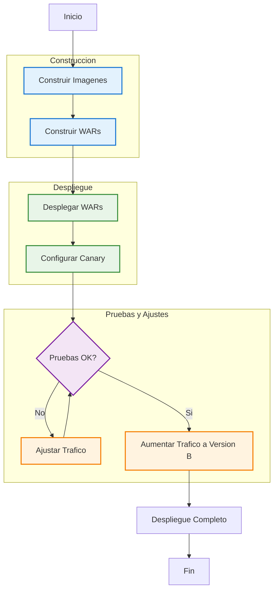
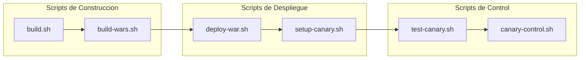

# Flujo de Despliegue Canary

## Scripts Utilizados en el Flujo

## Descripción del Flujo de Despliegue Canary

El diagrama muestra el flujo completo del proceso de despliegue canary en el proyecto Docker para Oracle WebLogic.

### Etapas del Proceso

1. **Construcción**
   - Construir Imágenes: Se crea la imagen Docker de WebLogic utilizando build.sh
   - Construir WARs: Se compilan los archivos WAR para las versiones A y B utilizando build-wars.sh

2. **Despliegue**
   - Desplegar WARs: Se despliegan los archivos WAR en WebLogic utilizando deploy-war.sh
   - Configurar Canary: Se configura el despliegue canary utilizando setup-canary.sh

3. **Pruebas y Ajustes**
   - Pruebas: Se realizan pruebas para verificar el funcionamiento del despliegue canary utilizando test-canary.sh
   - Ajustar Tráfico: Si las pruebas no son satisfactorias se ajusta el porcentaje de tráfico utilizando canary-control.sh
   - Aumentar Tráfico: Si las pruebas son satisfactorias se aumenta gradualmente el tráfico hacia la versión B

4. **Despliegue Completo**
   - Una vez que la versión B ha sido probada completamente se realiza el despliegue completo

### Scripts Utilizados

- build.sh: Construye la imagen Docker de WebLogic
- build-wars.sh: Compila los archivos WAR para WebLogic Features
- deploy-war.sh: Script unificado para desplegar archivos WAR
- setup-canary.sh: Configura el despliegue canary
- test-canary.sh: Prueba el despliegue canary
- canary-control.sh: Controla el porcentaje de tráfico entre versiones
