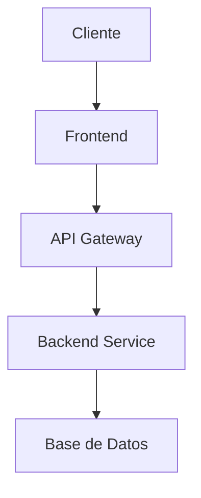

# poc-icbs

Integration service for ICBS (Integrated Core Banking System)

## 📋 Descripción

ICBS integration service

## 🏗️ Arquitectura



## 🚀 Inicio Rápido

### Prerrequisitos
- Node.js 18+
- npm o yarn
- Git

### Instalación
```bash
git clone https://github.com/giovanemere/poc-icbs.git
cd poc-icbs
npm install
```

### Desarrollo
```bash
npm run dev
```

## 📚 API Documentation

### Endpoints Principales

| Método | Endpoint | Descripción |
|--------|----------|-------------|
| GET    | /health  | Health check |
| GET    | /api/v1  | API version |

## 🔧 Configuración

### Variables de Entorno
```bash
NODE_ENV=development
PORT=3000
DATABASE_URL=postgresql://localhost:5432/db
```

## 🧪 Testing

```bash
npm test
npm run test:coverage
```

## 🚀 Despliegue

### Docker
```bash
docker build -t poc-icbs .
docker run -p 3000:3000 poc-icbs
```

### Kubernetes
```bash
kubectl apply -f k8s/
```

## 📊 Monitoreo

- **Métricas**: Prometheus
- **Logs**: ELK Stack
- **Alertas**: Grafana

## 🤝 Contribución

1. Fork del repositorio
2. Crear rama feature (`git checkout -b feature/nueva-funcionalidad`)
3. Commit cambios (`git commit -am 'Añadir nueva funcionalidad'`)
4. Push a la rama (`git push origin feature/nueva-funcionalidad`)
5. Crear Pull Request

## 📄 Licencia

Este proyecto está bajo la Licencia MIT.
