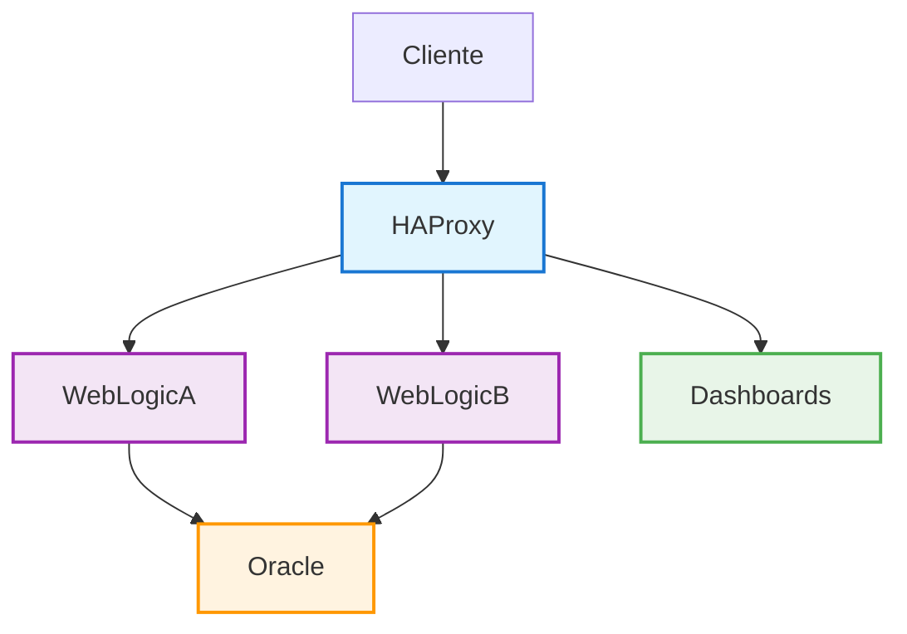

# 🚀 Docker WebLogic - Sistema Completo

Bienvenido a la documentación completa del **Sistema Oracle WebLogic con Testing A/B, Canary Deployment y Feature Flags**. Este sistema proporciona un entorno Docker completo para Oracle WebLogic con soporte para estrategias avanzadas de despliegue.

## 🎯 Características Principales

<div class="card-grid">
  <div class="card">
    <h3>🧠 Scripts Inteligentes</h3>
    <p>Sistema de detección automática que ejecuta la acción más eficiente según el estado actual de los servicios.</p>
  </div>
  
  <div class="card">
    <h3>🎛️ Dashboards Profesionales</h3>
    <p>Dashboards independientes para monitoreo en tiempo real, control de A/B Testing y Canary Deployment.</p>
  </div>
  
  <div class="card">
    <h3>⚖️ Load Balancing Avanzado</h3>
    <p>HAProxy configurado con soporte para A/B Testing, Canary Deployment y Feature Flags.</p>
  </div>
  
  <div class="card">
    <h3>🔌 APIs Completas</h3>
    <p>APIs REST para gestión de tráfico, estadísticas en tiempo real y control de despliegues.</p>
  </div>
</div>

## 🚀 Inicio Rápido

### Comando Principal (Recomendado)

```bash
cd /home/giovanemere/periferia/icbs/docker-for-oracle-weblogic && ./start.sh
```

Este comando utiliza **detección inteligente** para determinar el estado actual de los servicios y ejecutar la acción más eficiente.

### URLs Principales del Sistema

!!! info "URLs Principales"
    
    **🎛️ Dashboard Principal:**
    ```
    🎛️ http://localhost:8085/unified-dashboard-fixed.html  ⭐ Principal
    📊 http://localhost:8084/                              Dashboard de Tráfico
    ```

<div class="url-highlight">
<strong>🎛️ Dashboards Principales (Más Confiables)</strong>

| Componente | URL | Descripción |
|------------|-----|-------------|
| **Dashboard Unificado** | `http://localhost:8085/unified-dashboard-fixed.html` | ⭐ **Dashboard Principal** |
| **Dashboard de Tráfico** | `http://localhost:8084/` | Dashboard de tráfico y monitoreo |
| **Panel HAProxy** | `http://localhost:8092/index-functional.html` | Panel de administración HAProxy |
| **API Admin** | `http://localhost:8093/api/health` | API de administración |
</div>

## 🏗️ Arquitectura del Sistema



### Diagrama Detallado (Texto)

```
                    👤 Cliente
                        │
                        ▼
            ⚖️ HAProxy (Puerto 8100)
                   │         │
                   ▼         ▼
        🅰️ WebLogic A    🅱️ WebLogic B
         (Puerto 7001)   (Puerto 7002)
                   │         │
                   └────┬────┘
                        ▼
                🗄️ Oracle DB (Puerto 1521)

    📊 Dashboards Independientes (8084-8093)
```

!!! info "Diagramas Adicionales"
    Para ver más diagramas detallados de la arquitectura, consulta la [página de diagramas de arquitectura](arquitectura-diagrama.md).

### Puertos del Sistema

| Servicio | Puerto | Descripción |
|----------|--------|-------------|
| **HAProxy** | **8100** | **Frontend Principal** ✅ |
| **Dashboard Unificado** | **8085** | Dashboard Principal |
| **Dashboard de Tráfico** | **8084** | Dashboard de Tráfico |
| **Panel HAProxy** | **8092** | Panel de Administración |
| **API Admin** | **8093** | API de Administración |
| HAProxy Stats | 8404 | Estadísticas de HAProxy |
| WebLogic A | 7001 | Consola de Administración A |
| WebLogic B | 7002 | Consola de Administración B |
| Oracle DB | 1521 | Listener de Oracle |
| Oracle EM | 5500 | Enterprise Manager |

## 🧠 Scripts Inteligentes

El sistema incluye scripts inteligentes que detectan automáticamente el estado de los servicios:

### Scripts Principales

| Script | Descripción | Uso |
|--------|-------------|-----|
| **`./start.sh`** | ⭐ **PRINCIPAL** - Inicio inteligente | Uso diario |
| **`./smart-start.sh`** | 🧠 Motor de detección inteligente | Uso avanzado |
| **`./force-restart.sh`** | 🔄 Reinicio forzado completo | Problemas graves |
| **`./status.sh`** | 📊 Estado detallado del sistema | Monitoreo |
| **`./stop.sh`** | 🛑 Para todo el sistema | Al terminar |

### Lógica de Detección

!!! tip "Detección Automática"
    
    El sistema detecta automáticamente:
    
    - **🚀 Inicio Completo**: Si no hay contenedores
    - **▶️ Inicio Normal**: Si hay contenedores parados
    - **🔄 Reinicio Parcial**: Si algunos servicios están caídos
    - **⚡ Reinicio Rápido**: Si todos los servicios están corriendo

## 📊 Dashboards y Monitoreo

### Dashboard Unificado

El **Dashboard Principal** proporciona:

- 📊 **Monitoreo en Tiempo Real** de todos los servicios
- 🎯 **Control de A/B Testing** con porcentajes configurables
- 🚀 **Gestión de Canary Deployment** 
- 📈 **Métricas de Rendimiento** y estadísticas
- 🔗 **Enlaces Rápidos** a todos los servicios

### Dashboard de Tráfico

Especializado en:

- 📊 **Estadísticas de Tráfico** en tiempo real
- 🎯 **APIs de A/B Testing** (`/api/ab/apply`)
- 🚀 **APIs de Canary Deployment** (`/api/canary/apply`)
- 🔄 **Control de Estadísticas** (`/api/reset`)

## 🎮 Testing A/B y Canary Deployment

### A/B Testing

```bash
# Configurar A/B Testing (70% A, 30% B)
curl -X POST -H "Content-Type: application/json" \
  -d '{"percentage_a": 70, "percentage_b": 30}' \
  http://localhost:8084/api/ab/apply
```

### Canary Deployment

```bash
# Configurar Canary Deployment (20% canary)
curl -X POST -H "Content-Type: application/json" \
  -d '{"canary_percentage": 20}' \
  http://localhost:8084/api/canary/apply
```

## 🔌 APIs del Sistema

### APIs del Dashboard de Tráfico

| API | URL | Método | Descripción |
|-----|-----|--------|-------------|
| Health Check | `http://localhost:8084/api/health` | GET | Verificación de salud |
| Estadísticas | `http://localhost:8084/api/stats` | GET | Estadísticas en tiempo real |
| A/B Testing | `http://localhost:8084/api/ab/apply` | POST | Aplicar A/B Testing |
| Canary Deployment | `http://localhost:8084/api/canary/apply` | POST | Aplicar Canary Deployment |
| Reset Stats | `http://localhost:8084/api/reset` | POST | Reiniciar estadísticas |

### APIs de Administración

| API | URL | Descripción |
|-----|-----|-------------|
| Health Check | `http://localhost:8093/api/health` | Verificación de salud |
| Status | `http://localhost:8093/api/status` | Estado del sistema |

## 🎯 Flujo de Trabajo Recomendado

### Uso Diario

```bash
# 1. Iniciar sistema (detección inteligente)
./start.sh

# 2. Verificar estado
./status.sh

# 3. Acceder al dashboard principal
# http://localhost:8085/unified-dashboard-fixed.html

# 4. Al terminar, parar sistema
./stop.sh
```

### Desarrollo

```bash
# 1. Construir WAR files
./scripts/build/build-wars.sh

# 2. Construir imágenes Docker
./build-latest.sh

# 3. Iniciar sistema
./start.sh
```

## 🚨 Solución de Problemas

### Comandos de Diagnóstico

```bash
# Estado detallado del sistema
./status.sh

# Verificar todas las URLs
./verify-updated-urls.sh

# Reinicio forzado si hay problemas
./force-restart.sh

# Ver logs en tiempo real
docker-compose -f config/docker-compose.yml logs -f
```

### URLs de Respaldo

Si HAProxy falla, estos dashboards independientes siguen funcionando:

- `http://localhost:8085/unified-dashboard-fixed.html`
- `http://localhost:8084/`
- `http://localhost:8092/index-functional.html`
- `http://localhost:8093/api/health`

## 📚 Documentación Adicional

- [🏗️ Arquitectura del Sistema](architecture.md)
- [🚀 Guía de Despliegue](deployment-guide.md)
- [⚖️ Configuración HAProxy](haproxy-guide.md)
- [🧪 Testing A/B y Canary](canary-flow.md)
- [📊 Dashboards](dashboard.md)
- [🔌 APIs](api.md)
- [🔧 Troubleshooting](troubleshooting.md)

## 💡 Consejos y Mejores Prácticas

!!! tip "Recomendaciones"
    
    - **Los dashboards independientes** (8084, 8085, 8092, 8093) son más confiables
    - **El Frontend Principal** (8100) depende de que HAProxy esté funcionando
    - **Usa el Dashboard de Tráfico** (8084) para A/B Testing y Canary Deployment
    - **El Dashboard Unificado** (8085) es el más completo para monitoreo general

!!! warning "Importante"
    
    - Construye las imágenes localmente para mejor rendimiento
    - Verifica que todos los prerequisitos estén instalados
    - Usa `./status.sh` para monitorear el estado del sistema

## ✨ ¡Sistema Listo para Usar!

El sistema está completamente configurado y listo para usar. Ejecuta el comando principal para comenzar:

```bash
cd /home/giovanemere/periferia/icbs/docker-for-oracle-weblogic && ./start.sh
```

Luego accede al dashboard principal: **[http://localhost:8085/unified-dashboard-fixed.html](http://localhost:8085/unified-dashboard-fixed.html)** ⭐
