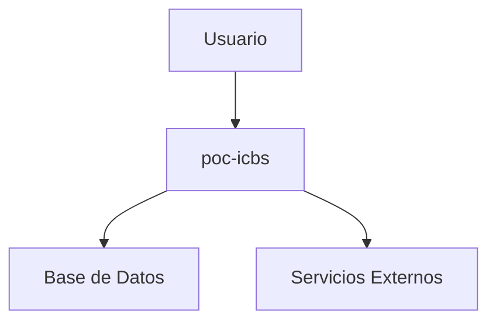

# poc-icbs

ICBS integration service

## Descripción

Este componente es parte de la plataforma IA-Ops y proporciona funcionalidades específicas para el ecosistema de aplicaciones.

## Arquitectura

## API

Para más detalles sobre la API, consulta [api.md](api.md).

## Despliegue

Para información sobre despliegue, consulta [deployment.md](deployment.md).

## Enlaces

- [Repositorio](https://github.com/giovanemere/poc-icbs)
- [GitHub Actions](https://github.com/giovanemere/poc-icbs/actions)
- [Issues](https://github.com/giovanemere/poc-icbs/issues)
