# Estructura del Proyecto

```mermaid
graph TD
    Root[docker-for-oracle-weblogic] --> Autodeploy[autodeploy]
    Root --> Backup[backup]
    Root --> Config[config]
    Root --> ContainerScripts[container-scripts]
    Root --> Deploy[deploy]
    Root --> Docker[docker]
    Root --> Docs[docs]
    Root --> Images[images]
    Root --> Install[install]
    Root --> References[references]
    Root --> Scripts[scripts]
    Root --> WarProjects[war-projects]
    Root --> RunSh[run.sh]
    Root --> SetupSh[setup.sh]
    
    Backup --> BackupFiles[Archivos de respaldo]
    BackupFiles --> DeployWeblogicBak[deploy-weblogic.sh.bak]
    BackupFiles --> DeployBak[deploy.sh.bak]
    
    Config --> ConfigFiles[Archivos de configuracion]
    ConfigFiles --> DockerCompose[docker-compose.yml]
    ConfigFiles --> DockerComposeEE[docker-compose-EE.yml]
    ConfigFiles --> DemoOracleDDL[demo_oracle.ddl]
    ConfigFiles --> K8sYaml[weblogic-oracledb-kubernetes.yaml]
    
    ContainerScripts --> CS1[canary-control.sh]
    ContainerScripts --> CS2[setup-monitoring.sh]
    ContainerScripts --> CS3[startSample.sh]
    
    Deploy --> D1[feature-flags.war]
    Deploy --> D2[ff4j-simple.war]
    Deploy --> D3[weblogic-features-a.war]
    Deploy --> D4[weblogic-features-b.war]
    
    Docker --> Dockerfile[Dockerfile]
    
    Docs --> DocsFiles[Archivos de documentacion]
    DocsFiles --> Arquitectura[arquitectura.md]
    DocsFiles --> CanaryFlow[canary-flow.md]
    DocsFiles --> ProjectStructure[project-structure.md]
    
    Install --> InstallFiles[Archivos de instalacion]
    InstallFiles --> WebLogicZip[fmw_14.1.1.0.0_wls_Disk1_1of1.zip]
    InstallFiles --> SQLCLZip[sqlcl-25.2.2.199.0918.zip]
    
    References --> RefsFiles[Archivos de referencia]
    RefsFiles --> CanaryDeployment[canary-deployment.md]
    RefsFiles --> FF4JIntegration[ff4j-integration.md]
    RefsFiles --> WebLogicCommands[weblogic-commands.md]
    
    Scripts --> BuildScripts[build]
    Scripts --> DeployScripts[deploy]
    Scripts --> CanaryScripts[canary]
    
    BuildScripts --> BS1[build.sh]
    BuildScripts --> BS2[build-wars.sh]
    BuildScripts --> BS3[build-feature-flags.sh]
    BuildScripts --> BS4[create-simple-wars.sh]
    
    DeployScripts --> DS1[deploy-war.sh]
    DeployScripts --> DS2[deploy-feature-flags.py]
    
    CanaryScripts --> CS1_1[setup-canary.sh]
    CanaryScripts --> CS1_2[canary-control.sh]
    CanaryScripts --> CS1_3[test-canary.sh]
    CanaryScripts --> CS1_4[setup-canary.py]
    CanaryScripts --> CS1_5[switch-canary.py]
    
    WarProjects --> WP1[feature-flags]
    WarProjects --> WP2[version-a]
    WarProjects --> WP3[version-b]
    
    classDef directory fill:#f9f9f9,stroke:#333,stroke-width:1px
    classDef file fill:#e8f4ea,stroke:#333,stroke-width:1px
    classDef script fill:#e6f3ff,stroke:#333,stroke-width:1px
    classDef war fill:#ffe6e6,stroke:#333,stroke-width:1px
    
    class Root,Autodeploy,Backup,Config,ContainerScripts,Deploy,Docker,Docs,Images,Install,References,Scripts,WarProjects directory
    class BackupFiles,ConfigFiles,DocsFiles,InstallFiles,RefsFiles,BuildScripts,DeployScripts,CanaryScripts directory
    class DeployWeblogicBak,DeployBak,DockerCompose,DockerComposeEE,DemoOracleDDL,K8sYaml,Dockerfile,Arquitectura,CanaryFlow,ProjectStructure,WebLogicZip,SQLCLZip,CanaryDeployment,FF4JIntegration,WebLogicCommands file
    class CS1,CS2,CS3,BS1,BS2,BS3,BS4,DS1,DS2,CS1_1,CS1_2,CS1_3,CS1_4,CS1_5,RunSh,SetupSh script
    class D1,D2,D3,D4,WP1,WP2,WP3 war
```


    classDef config fill:#fff2cc,stroke:#333,stroke-width:1px
    classDef install fill:#e6ccff,stroke:#333,stroke-width:1px
    
    class Root,Autodeploy,Backup,Config,ContainerScripts,Deploy,Docker,Docs,Images,Install,References,Scripts,WarProjects,BuildScripts,DeployScripts,CanaryScripts,WP1,WP2,WP3 directory
    class DockerCompose,DockerComposeEE,DemoOracleDDL,K8sYaml,Arquitectura,CanaryFlow,ProjectStructure,CanaryDeployment,FF4JIntegration,WebLogicCommands,Dockerfile,DeployWeblogicBak,DeployBak config
    class BS1,BS2,BS3,BS4,DS1,DS2,CS1_1,CS1_2,CS1_3,CS1_4,CS1_5,CS1,CS2,CS3,RunSh,SetupSh script
    class D1,D2,D3,D4 war
    class WebLogicZip,SQLCLZip install
```

## Descripción de la Estructura del Proyecto

El diagrama muestra la estructura reorganizada del proyecto Docker para Oracle WebLogic.

### Directorios Principales

1. **autodeploy/**
   - Directorio temporal para despliegue automático de archivos WAR

2. **backup/**
   - deploy-weblogic.sh.bak: Respaldo del script de despliegue de WebLogic
   - deploy.sh.bak: Respaldo del script de despliegue

3. **config/**
   - docker-compose.yml: Configuración de Docker Compose
   - docker-compose-EE.yml: Configuración para Docker Enterprise Edition
   - demo_oracle.ddl: Script SQL para la base de datos
   - weblogic-oracledb-kubernetes.yaml: Configuración para Kubernetes

4. **container-scripts/**
   - canary-control.sh: Control de canary dentro del contenedor
   - setup-monitoring.sh: Configura la exposición de logs
   - startSample.sh: Script de inicio para el contenedor

5. **deploy/**
   - feature-flags.war: Aplicación de Feature Flags
   - ff4j-simple.war: Consola simulada de FF4J
   - weblogic-features-a.war: Versión A para despliegue canary
   - weblogic-features-b.war: Versión B para despliegue canary

6. **docker/**
   - Dockerfile: Dockerfile para construir la imagen

7. **docs/**
   - arquitectura.md: Diagrama de arquitectura
   - canary-flow.md: Diagrama de flujo de despliegue canary
   - project-structure.md: Diagrama de estructura del proyecto

8. **images/**
   - Imágenes para la documentación

9. **install/**
   - fmw_14.1.1.0.0_wls_Disk1_1of1.zip: Oracle WebLogic Server Installer
   - sqlcl-25.2.2.199.0918.zip: Oracle SQL Developer Command Line

10. **references/**
    - canary-deployment.md: Guía de despliegue canary
    - ff4j-integration.md: Guía de integración de FF4J
    - weblogic-commands.md: Comandos útiles de WebLogic

11. **scripts/**
    - **build/**
      - build.sh: Construye la imagen Docker
      - build-wars.sh: Compila los archivos WAR
      - build-feature-flags.sh: Compila la aplicación de Feature Flags
      - create-simple-wars.sh: Crea archivos WAR simples
    - **deploy/**
      - deploy-war.sh: Despliega archivos WAR
      - deploy-feature-flags.py: Script Python para desplegar Feature Flags
    - **canary/**
      - setup-canary.sh: Configura el despliegue canary
      - canary-control.sh: Controla el porcentaje de tráfico
      - test-canary.sh: Prueba el despliegue canary
      - setup-canary.py: Script Python para configurar canary
      - switch-canary.py: Script Python para cambiar entre versiones

12. **war-projects/**
    - feature-flags/: Proyecto de Feature Flags
    - version-a/: Versión A para despliegue canary
    - version-b/: Versión B para despliegue canary

13. **run.sh**
    - Script de ayuda para ejecutar comandos

14. **setup.sh**
    - Script de instalación y configuración inicial del proyecto
