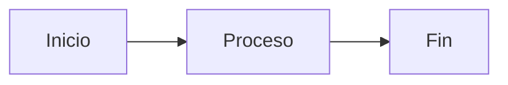
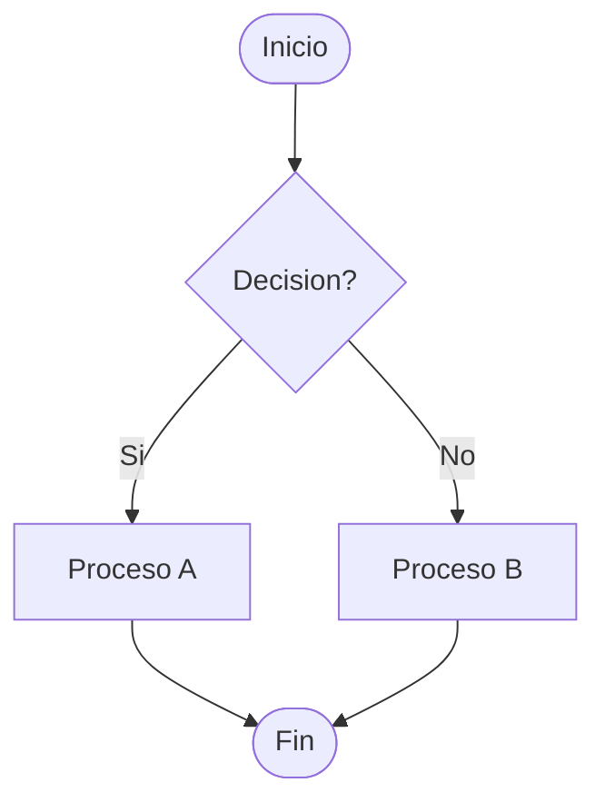
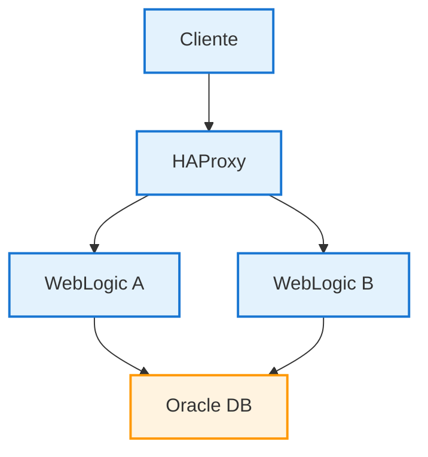
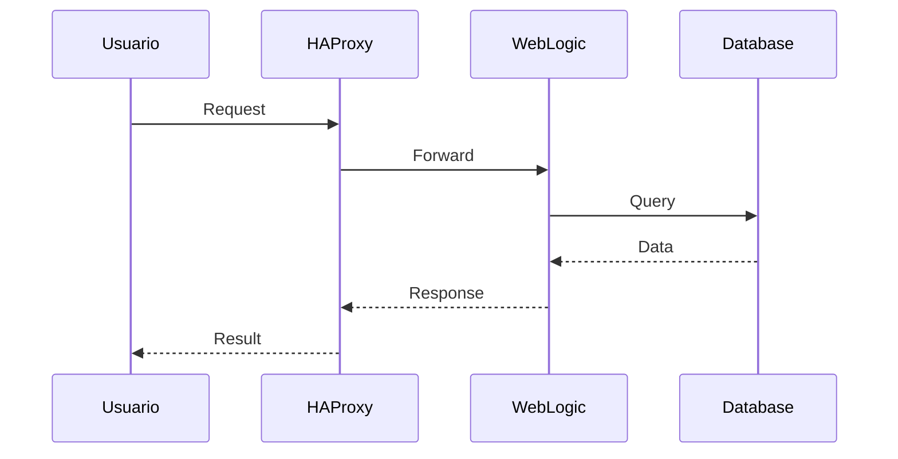
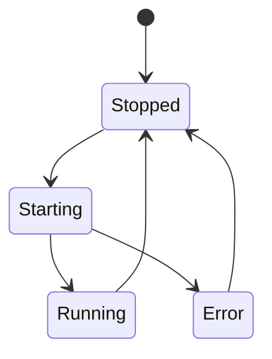
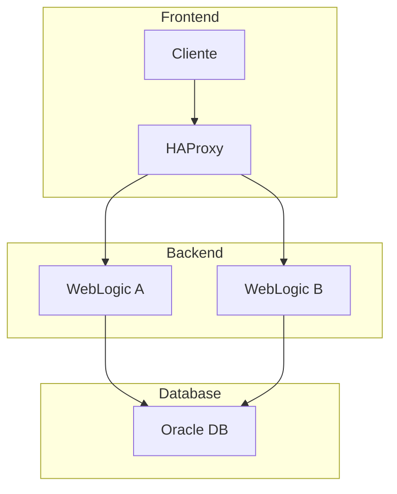
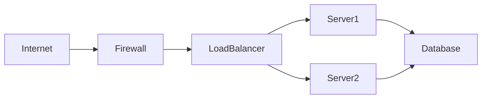

# 🧪 Prueba de Diagramas Mermaid

Esta página contiene diagramas de prueba para verificar que Mermaid 9.4.3 funciona correctamente.

## Diagrama Simple

## Diagrama de Flujo

## Arquitectura del Sistema (Compatible)

## Diagrama de Secuencia Simple

## Diagrama de Estados Simple

## Diagrama con Subgrafos

## Diagrama de Red Simple

Si ves estos diagramas correctamente, Mermaid 9.4.3 está funcionando! ✅

## Notas de Compatibilidad

Para Mermaid 9.4.3:
- ✅ Evitar emojis en los nodos
- ✅ Usar texto simple en las etiquetas
- ✅ Evitar ` ` en los nodos
- ✅ Usar sintaxis de estilos completa
- ✅ Mantener nombres de nodos simples
